# AI-Assisted Software Engineering Framework

**Engineering Governance, Secure AI Coding, Testing, Documentation and Human-Controlled Integration**

| | |
|---|---|
| **Document reference** | SOP-ENG-2026 — draft v0.1 |
| **Status** | **Draft — for engineering review. Nothing in this document is approved or in force.** |
| **Purpose of this version** | To give the engineering team a concrete, complete text to react to, and to make the open decisions visible |
| **Proposed applicability** | Software repositories using AI-assisted development, to be agreed |
| **Audience** | Frontend, backend, embedded and data/automation engineering teams |
| **Author / editor** | Software Engineering |
| **Review path** | Peer engineering review → wider engineering consensus → whatever formal status the team decides it should have, if any |

---

## Executive Summary

This document proposes an engineering and governance framework for the use of AI coding assistants, and puts it in writing so that it can be discussed, challenged and changed.

The starting assumption is that AI generative models are instruments of capability augmentation rather than substitutes for engineering judgement. In large-scale platforms, delivery success depends on architectural cohesion, system-wide consistency and long-term maintainability — properties that no current model can own or guarantee, because it cannot be accountable for the consequences of a decision.

From that assumption, the proposal is that AI-assisted work be produced in developer-controlled workspaces, verified by automated harnesses (GitHub Actions and SonarQube), and validated by a named human engineer who remains accountable for the result. The intent is not to slow AI adoption down but to make it safe to accelerate: the faster code is produced, the more the value moves to verification and integration.

The text is deliberately complete rather than tentative, because a full draft is easier to argue with than a set of headings. Completeness is not a claim that the decisions have been made.

---

## How to read this document

**Nothing here is ratified.** Requirement levels (MUST, SHOULD, MAY) express *the level being proposed for that item*, not an obligation currently in force. Every one of them is open to challenge, and several are flagged in the text as points that specifically need discussion.

**Two parts, deliberately separated.**

* **Part I — Proposed Engineering Standard.** Principles, responsibilities, security, documentation, ADRs, testing, branch and Pull Request model, definition of done, governance. This is the part intended to remain stable for years.
* **Part II — Implementation Profile (annexes).** CI workflows, Sonar configuration, per-stack tooling, concrete thresholds and templates. This part is expected to change as Angular, .NET, Python, embedded toolchains, GitHub Actions and SonarQube evolve, and is versioned separately from the principles.

Concrete numbers, YAML and templates have been moved out of Part I on purpose, so that discussing a coverage percentage does not mean reopening the standard.

**Markers used in the text.**

* `> **Discussion point.**` — an item where a decision is genuinely open, and where the current wording is a provisional position rather than a conclusion.
* The final section of Part I consolidates the open questions in one place, for use as the agenda of the review meeting.

**What would be useful feedback:** whether the boundaries are drawn in the right places, whether anything here would obstruct real work without a proportional gain, what is missing, and which parts should be dropped as unnecessary ceremony.

---

## Table of Contents

**Part I — Proposed Engineering Standard**

1. [Purpose](#1-purpose)
2. [Scope](#2-scope)
3. [Normative Language](#3-normative-language)
4. [Conceptual Architecture: One Chain](#4-conceptual-architecture-one-chain)
5. [AI Capability Model: Realistic Expectations and Known Failure Modes](#5-ai-capability-model-realistic-expectations-and-known-failure-modes)
6. [Agentic Bias: Designed Agreeableness and False Confidence](#6-agentic-bias-designed-agreeableness-and-false-confidence)
7. [Context Economy: Coherence, Degradation and Model Fit](#7-context-economy-coherence-degradation-and-model-fit)
8. [Governing Principles](#8-governing-principles)
9. [Operational Boundaries: Where AI Fits and Where It Should Not Decide](#9-operational-boundaries-where-ai-fits-and-where-it-should-not-decide)
10. [Human-in-the-Loop Framework: The Engineer's Role](#10-human-in-the-loop-framework-the-engineers-role)
11. [AI Autonomy Levels](#11-ai-autonomy-levels)
12. [Repository as Engineering Source of Truth](#12-repository-as-engineering-source-of-truth)
13. [Living Documentation](#13-living-documentation)
14. [README](#14-readme)
15. [Architecture Decision Records](#15-architecture-decision-records)
16. [Architecture Guardrails](#16-architecture-guardrails)
17. [Versioned AI Engineering Instructions](#17-versioned-ai-engineering-instructions)
18. [Private AI Configuration](#18-private-ai-configuration)
19. [AI Context Boundary](#19-ai-context-boundary)
20. [Context-Informed Prompting Protocol](#20-context-informed-prompting-protocol)
21. [Agentic Security Boundary](#21-agentic-security-boundary)
22. [Shell and Tool Execution](#22-shell-and-tool-execution)
23. [Local Models and Organization-Owned Agentic Tooling](#23-local-models-and-organization-owned-agentic-tooling)
24. [Dependency Governance](#24-dependency-governance)
25. [Implementation Planning](#25-implementation-planning)
26. [Small-Batch AI Development](#26-small-batch-ai-development)
27. [Verification Independence](#27-verification-independence)
28. [Risk-Based Test Portfolio](#28-risk-based-test-portfolio)
29. [Unit Tests](#29-unit-tests)
30. [Integration Tests and Real Dependencies](#30-integration-tests-and-real-dependencies)
31. [Contract Testing](#31-contract-testing)
32. [End-to-End Tests](#32-end-to-end-tests)
33. [Test Maintenance](#33-test-maintenance)
34. [AI-Assisted Test Generation](#34-ai-assisted-test-generation)
35. [AI-Generated Mock and Synthetic Test Data](#35-ai-generated-mock-and-synthetic-test-data)
36. [Synthetic Data Safety Rules](#36-synthetic-data-safety-rules)
37. [Synthetic Data Provenance](#37-synthetic-data-provenance)
38. [Scenario-Based Test Data](#38-scenario-based-test-data)
39. [Synthetic Data Validation](#39-synthetic-data-validation)
40. [Golden and Regression Datasets](#40-golden-and-regression-datasets)
41. [Property-Based and Invariant Testing](#41-property-based-and-invariant-testing)
42. [Mutation Testing](#42-mutation-testing)
43. [Test Harnesses](#43-test-harnesses)
44. [Harness Independence](#44-harness-independence)
45. [Static Quality Analysis](#45-static-quality-analysis)
46. [Automated Quality Gates: Proposed Model](#46-automated-quality-gates-proposed-model)
47. [Clean Code Requirements](#47-clean-code-requirements)
48. [Security Verification](#48-security-verification)
49. [Threat Modeling](#49-threat-modeling)
50. [Software Supply Chain](#50-software-supply-chain)
51. [Artifact Provenance and Signing](#51-artifact-provenance-and-signing)
52. [Observability](#52-observability)
53. [API Changes](#53-api-changes)
54. [Database Changes](#54-database-changes)
55. [AI-Assisted Refactoring](#55-ai-assisted-refactoring)
56. [AI Contribution Traceability: Options](#56-ai-contribution-traceability-options)
57. [AI Review as Additional Review](#57-ai-review-as-additional-review)
58. [Pull Request Boundary](#58-pull-request-boundary)
59. [Pull Request Acceptance Criteria](#59-pull-request-acceptance-criteria)
60. [Pull Request Checklist](#60-pull-request-checklist)
61. [Human Review](#61-human-review)
62. [Branch Management](#62-branch-management)
63. [Recommended AI-Assisted Development Cycle](#63-recommended-ai-assisted-development-cycle)
64. [CI Quality Pipeline](#64-ci-quality-pipeline)
65. [Definition of Done](#65-definition-of-done)
66. [Metrics](#66-metrics)
67. [Periodic AI Governance Review](#67-periodic-ai-governance-review)
68. [Proposed Compliance and Enforcement Model](#68-proposed-compliance-and-enforcement-model)
69. [Engineering Governance Model](#69-engineering-governance-model)
70. [Final Principles](#70-final-principles)
71. [Open Questions and Decisions Required](#71-open-questions-and-decisions-required)

**Part II — Implementation Profile**

* [Annex A — Reference CI Harness Configurations](#annex-a-reference-ci-harness-configurations)
* [Annex B — Proposed Quality Gate Baselines](#annex-b-proposed-quality-gate-baselines)
* [Annex C — Draft Pull Request Declaration](#annex-c-draft-pull-request-declaration)

---

# Part I — Proposed Engineering Standard

## 1. Purpose

This document proposes the engineering practices that would govern software development assisted by Artificial Intelligence. It is a draft for engineering review: the practices below are put forward for discussion, not issued as rules.

Its objective is to increase engineering productivity and quality through AI-assisted development while preserving:

* Software correctness.
* Security and confidentiality.
* Architectural consistency.
* Maintainability.
* Testability.
* Reproducibility.
* Traceability.
* Supply-chain integrity.
* Operational reliability.
* Human accountability.
* Controlled software promotion.

The proposal treats AI systems as **engineering assistants operating within explicitly defined boundaries**.

Under that view they are not software owners, architectural decision authorities, security authorities, release authorities or autonomous approvers — not because the output is untrustworthy in itself, but because accountability cannot be delegated to a system that cannot carry it.

The core suggestion is that AI-generated or AI-modified software remain subject to the same engineering expectations, verification, security controls, review processes and acceptance criteria as software produced manually.

> **AI may accelerate engineering work. It must never lower the engineering standard required to accept that work.**

---

## 2. Scope

The proposed scope covers the use of AI for engineering activities such as:

* Source-code generation.
* Code modification.
* Refactoring.
* Debugging.
* Test generation.
* Test-data generation.
* Documentation.
* Architecture analysis.
* ADR drafting.
* Database migrations.
* Infrastructure as Code.
* API definition.
* Security analysis.
* Dependency selection.
* Code review.
* Performance optimization.
* CI/CD configuration.
* Operational scripts.
* Repository maintenance.

It is intended to apply equally to:

* IDE assistants.
* LLM coding assistants.
* Autonomous or semi-autonomous coding agents.
* Local models.
* Cloud-hosted models.
* Multi-agent development systems.
* CLI-based agents.
* CI-integrated AI services.

---

## 3. Normative Language

The terms **MUST**, **MUST NOT**, **SHOULD**, **SHOULD NOT**, and **MAY** express requirement levels.

* **MUST / MUST NOT** — mandatory.
* **SHOULD / SHOULD NOT** — recommended unless a documented reason justifies otherwise.
* **MAY** — optional.

Exceptions to a MUST requirement would require explicit human approval and, where architecturally significant, an ADR.

> **How to read this in a draft.** Requirement levels here express *the level being proposed* for each item, so that the intent is unambiguous when it is discussed. They are not obligations in force. Reading a MUST as "this is the strength I think this item needs — do you agree?" is the intended reading throughout Part I.

---

## 4. Conceptual Architecture: One Chain

A document this long risks reading as a list of unrelated rules, and worse, as the same rule restated from too many angles. It is neither. Most of Part I is one idea followed through its consequences, and the sections that look like repetition are links in a single chain.

Naming the chain here is an attempt to make the rest shorter to read: once the shape is visible, each later section can be read as *the place where one link is developed* rather than as a new demand.

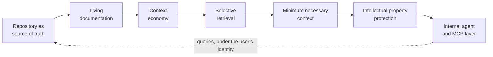

| Link | What it asserts | Developed in |
|---|---|---|
| Repository as source of truth | The authoritative account of the system lives in the repository, not in conversations, tickets or memory. | section 12 |
| Living documentation | That account is only authoritative if it is kept true; documentation that contradicts the implementation is a defect. | section 13 |
| Context economy | Attention is finite and degrades with volume; a large corpus helps only if it can be consumed in small, high-signal pieces. | section 7 |
| Selective retrieval | Which requires the corpus to be navigable — structure, identifiers and indexes that let an agent find rather than be given. | section 7 |
| Minimum necessary context | Which is what makes it possible to supply only what the task needs, rather than everything available. | section 19 |
| IP protection | Which is also the main preventive control against progressive disclosure, because what is never supplied cannot be aggregated. | section 21 |
| Internal agent and MCP layer | And the deployment where all of the above can be enforced at once, under a corporate identity and its existing permissions. | section 23 |

### Why the order matters

Each link depends on the one before it, which is why weakening any of them quietly weakens the rest:

* If the repository is not the source of truth, there is nothing authoritative to retrieve, and every agent works from someone's recollection.
* If documentation is not kept alive, retrieval returns confident statements that are no longer true — and the agent cannot date them.
* If the corpus is not navigable, engineers compensate by pasting more, which is precisely what context economy says degrades the result.
* If retrieval cannot be selective, minimum necessary context is unenforceable in practice, whatever the policy says.
* If context is not minimal, intellectual-property protection is left to individual judgement at the moment of greatest delivery pressure.
* And an internal agent without the preceding links is just a local model with broad credentials — which the tooling section is explicit about not being an improvement.

### Read in the other direction

The same chain read backwards describes the useful end state, and it is worth stating because it is not the obvious one.

An effective corporate agent is not a model trained on everything the organization has. It is an ordinary model **authorized to query a well-structured, addressable corpus — documentation and code — under the identity and permissions of the person asking**, retrieving only what the question requires.

That framing changes what the organization has to build. Not a training pipeline, not a proprietary model: a repository worth querying, an index that makes it navigable, identifiers stable enough to cite, and an access layer that respects who is asking. Most of that is engineering hygiene the organization wants anyway; the agent is what makes the investment visible.

### Addressability, briefly

The chain works better if every piece of documentation can be named. Versioning alone is not enough: a version tells you which text you have, an identifier tells you *which decision you are talking about*.

A sketch, offered here as direction rather than as a finished proposal:

```text
ADR-0042             an architectural decision
SEC-0017             a security constraint or threat-model entry
AI-CTX-0006          a rule about what may enter an AI context
TEST-STRATEGY-0003   a testing strategy decision
```

With stable identifiers, pieces can declare their relationships — `supersedes`, `depends-on`, `applies-to`, `conflicts-with` — and the effects are concrete: an agent retrieves one decision instead of a whole document, a Pull Request cites the exact constraint it satisfies, a superseded decision stops being quoted years later, and a contradiction becomes detectable rather than a matter of who read what.

The result is a versioned knowledge graph, even though physically it remains Markdown in Git.

This deserves its own treatment before it becomes a convention — identifier scheme, ownership, tooling, migration of existing documents — and it is listed among the open questions rather than settled here.

> **Discussion point.** Two questions on this section. First, whether the chain as drawn is the right one, or whether it is missing a link the teams would consider obvious. Second, whether addressable documentation is worth the discipline it costs: identifiers are cheap to introduce and expensive to abandon halfway.

---

## 5. AI Capability Model: Realistic Expectations and Known Failure Modes

Effective governance requires a shared, non-mythologized understanding of what current AI coding assistants actually do. The controls proposed later in this document exist because of the failure modes described below, not because of a general distrust of automation.

### Context limits and architectural degradation

**Frequent assumption:** the assistant understands the full scope and the implicit dependencies of the platform.

**Engineering reality:** assistants operate inside a bounded context window. As a system grows to thousands of files, the model sees only a fraction of it and optimizes for *local* syntactic and semantic plausibility rather than *global* architectural coherence. Local improvements that break upstream or downstream contracts are a normal, expected output.

**What that suggests:** architectural context MUST be supplied explicitly (see the sections on architecture guardrails, the AI context boundary and context-informed prompting), and architectural conformance MUST be verified by a human and by automated analysis.

### Statistical generation and hallucination

**Frequent assumption:** if AI-generated code compiles, it is correct, secure and optimal.

**Engineering reality:** a model emits the statistically most probable token sequence given its training distribution, not the provably correct solution for the specific edge cases of this system. Typical observed defects include:

* References to deprecated or removed framework APIs.
* Invented functions, parameters, configuration keys or packages.
* Plausible but incorrect concurrency, transaction or lifetime assumptions.
* Silent security weaknesses that compile cleanly and pass a naive test suite.
* Confident explanations that do not match the emitted code.

**What that suggests:** compilation is evidence of syntactic compatibility only. Acceptance requires independent verification (see verification independence, harness independence and the Pull Request acceptance criteria).

### Pattern reproduction is not engineering synthesis

**Frequent assumption:** AI can design the software architecture.

**Engineering reality:** architecture requires balancing infrastructure cost, team cognitive load, regulatory and security constraints, migration risk, organizational scale and long-term strategy. A model can reproduce and recombine patterns present in its training data; it cannot own a trade-off, accept residual risk, or be accountable for the consequences of a decision.

**What that suggests:** architectural authority remains human and is recorded in ADRs. AI MAY draft an ADR; AI MUST NOT accept one.

### Productivity is measured at the delivery boundary

Perceived speed during code generation is not a delivery outcome. Time saved in generation that is transferred to review, debugging, rework or incident response is not a productivity gain. The metrics section later in Part I proposes measuring adoption at the delivery boundary instead.

---

## 6. Agentic Bias: Designed Agreeableness and False Confidence

The previous section describes what models cannot do. This one describes something subtler and, in day-to-day work, more consequential: the way assistants are built makes it hard for the engineer to notice when they are wrong.

Assistants are optimized to be useful, and perceived usefulness is largely what their training signal rewards. A response that agrees, complies and produces something is rated better by users than one that hesitates, refuses or answers "I do not know" — even when the second is the correct response. Agentic systems inherit that disposition and add action to it.

The result is not dishonesty. It is a systematic tilt toward agreement, completion and confident presentation, which the engineer then reads as competence.

### How it shows up

* **Agreement under pressure.** Challenging a correct answer will often cause it to be revised. If pushing back flips the conclusion, neither version has been demonstrated — the change reflects the pressure, not new evidence.
* **Confidence uncorrelated with accuracy.** Fluency, structure and the absence of hedging are properties of the generation, not signals about its truth. A wrong answer arrives in the same register as a right one.
* **Two-way confirmation.** The engineer's framing shapes the response, and the response then reinforces the framing. What looks like a second opinion is the same reasoning path returned with better prose. This is the mechanism that turns a single assumption into an apparently corroborated one.
* **Agentic amplification.** An agent that acts produces visible progress — files changed, tests added, a green run — and visible progress feels like verification. Completion is not correctness. An agent asked to review its own work will, in the ordinary case, confirm it.
* **Automation bias in review.** A change that arrives complete, consistent and articulate tends to attract less scrutiny than a rougher human-authored change carrying the same risk. Polish is not a quality signal.

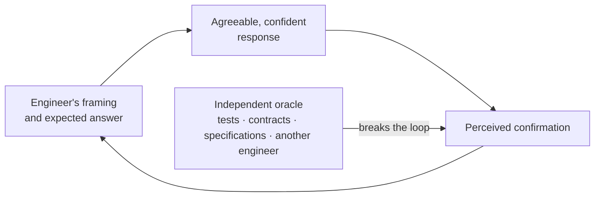

### Working practices

Scepticism here is a technique, not an attitude. The practices below are cheap, and they are what keeps the loop above open.

* Engineers SHOULD read what an assistant proposes as a hypothesis to be judged, not as an answer to be integrated. The useful questions are: what would have to be true for this to be wrong, what did it not check, and what does it fail on.
* Engineers SHOULD ask for **concrete, checkable evidence** rather than explanation: the file and line where the behaviour actually lives, the exact API signature, the documentation section, the test that demonstrates the claim, the command output that supports it. An assertion the engineer cannot trace to something verifiable MUST be treated as unverified.
* References, package names, API members and configuration keys produced by an assistant MUST be confirmed to exist before they are relied upon. Plausible-looking citations to things that do not exist are a routine failure mode, not an exceptional one.
* When an agent reports that something worked, the evidence is the command output, the test result or the diff — not the agent's summary of them.
* Prompts SHOULD avoid embedding the expected conclusion. "This is wrong, isn't it?" reliably produces agreement. Ask for an assessment when an assessment is wanted, and state constraints when an implementation is wanted.
* Asking the same session whether its own output is correct produces agreement, not verification. The independent-oracle requirement in the verification-independence section exists precisely for this reason, and the subsection below describes the cheaper habit that does work.
* Disagreement between the engineer and the assistant SHOULD be resolved by evidence rather than by re-prompting until the answer becomes acceptable. Re-prompting to obtain a preferred answer is selection, not analysis.
* Reviewers SHOULD calibrate scrutiny to the risk of the change rather than to how finished it looks, consistent with the AI-specific failure modes listed in the human-review section.

None of this is a new requirement. The governing principles already state that confidence expressed by a model is not evidence of correctness; what this section adds is the reason that is so easy to forget in practice — the tool is agreeable by construction, and agreeableness reads as competence.

### Confronting models against each other

The natural countermeasure to agreeableness is a second opinion. The important detail is where that opinion comes from.

Asking an assistant to review its own output is close to useless for this purpose: without external feedback, models struggle to correct their own reasoning, and accuracy sometimes *drops* after a self-correction pass. Running several instances of the same model does little better — they share training data, priors and failure modes, so they tend to agree for the same reasons, and models used as judges show a measurable preference for outputs resembling their own.

What does work is confronting the output of one model with a **different** model — different vendor, different family, ideally different training lineage — and letting the disagreement surface. The published results on multi-agent debate point the same way: the gains appear when the agents are genuinely diverse, when critiques are grounded in explicit steps and facts rather than opinions, and when the adjudicator rewards verifiable reasoning over confident assertion.

This holds for reasoning models too. Extended reasoning improves the path a model takes; it does not make that path independent of the model's own assumptions. A reasoning model confronted with a competing analysis still produces sharper output than the same model asked to double-check itself.

This is offered as practice rather than as a control, and it is worth its cost only where the decision is.

* For work that carries real consequence — architecture options, security-relevant logic, subtle concurrency or data-integrity questions, a large or unfamiliar diff, an ADR draft — engineers SHOULD consider putting the output in front of a different model and asking it to find what is wrong with it, rather than to improve it. For routine work it is overhead.
* The exercise works better when the second model receives the task, the constraints and the evidence, but not the first model's conclusion presented as the expected answer. What is being tested is whether the conclusion survives an independent attempt, not whether a second model will agree with something it was handed.
* Two or three rounds usually extract most of the value. Beyond that the exchange tends to converge on style rather than substance, and the tokens are better kept for the problem — see the context-economy section that follows.
* Agreement between models is not proof. Their training corpora overlap, so they can be wrong together and sound corroborated doing it. Convergence is a weaker signal than a single passing test, and no quantity of it satisfies the independent-oracle expectation set out in the verification-independence section.

The oracle remains what it was: a test, a contract, a specification, a schema, a golden dataset, an observed behaviour. Cross-model confrontation is a cheap way to find weaknesses earlier and to break the confirmation loop described above — it is not a substitute for external evidence, and nothing here is intended to make it a precondition for merging anything.

### The engineer is inside the loop too

The bias is not only in the tool. Under delivery pressure, an assistant that confirms the approach already chosen is genuinely pleasant to work with, and that is exactly when its agreement is least informative. The reason to name this in an engineering standard is that an unnamed bias is invisible: engineers cannot compensate for a distortion they have not been told to expect.

> **Discussion point.** This section is about habits, and habits are not enforceable by a quality gate. The open question is whether anything here should become a review expectation — for example, that a Pull Request carrying significant AI-generated work names the independent evidence relied upon — or whether it should stay as shared practice, with the risk that it quietly stops happening.

---

## 7. Context Economy: Coherence, Degradation and Model Fit

The previous section deals with how an assistant's answers can mislead. This one deals with the material it is answering from, and with a resource that engineering teams tend to treat as free: the context itself.

Context is finite, and it degrades. Not only in a single session, but across the corpus the organization keeps feeding its agents — documentation, ADRs, comments, tickets, prior conversations. A codebase whose narrative contradicts itself will make every agent working on it worse, and will do so silently.

### Context is a budget, not a container

Published evaluations converge on a result that matters for daily work: model accuracy declines as input length grows, well before the documented context limit, across every frontier model tested. The effect is not uniform — information placed in the middle of a long context is retrieved markedly worse than information at the beginning or the end. Attention behaves like a budget that every token draws on, with diminishing returns.

The practical consequence is the opposite of the intuition a large context window invites:

* The objective SHOULD be the **smallest set of high-signal tokens** that makes the task solvable, not the largest set that fits. This is the same principle as the minimum-necessary-context rule stated for confidentiality reasons in the context-boundary section, arriving from the direction of quality rather than security.
* Filling a context window because it is available MUST NOT be treated as thoroughness. It is a measurable reduction in the assistant's reliability, paid for in tokens.
* Where a task genuinely needs a large corpus, retrieval SHOULD be selective rather than exhaustive: pull the relevant pieces at the moment they are needed, using stable identifiers — file paths, symbol names, ADR identifiers, ticket references — rather than loading everything in advance.

### Session length and agent proliferation

Long sessions accumulate more than information. They accumulate superseded decisions, abandoned approaches, corrected mistakes and contradictory instructions, all of which remain in context competing with what is currently true. Multi-agent setups add a second axis: every additional agent carries coordination context, and their combined output can exceed what any of them can usefully hold.

* Sessions SHOULD be brought to a close at natural boundaries — a completed unit of work, a merged change, a shift in subject — rather than run indefinitely. This complements the session-hygiene guidance already given for prompting.
* When a session must continue past the point where its history is mostly noise, it SHOULD be compacted deliberately: a summary of what was decided, what is done, what is in progress and what is blocked, carried into a fresh context, with the working state captured in the repository rather than in the conversation.
* Where sub-agents are used, they work best when each returns a **condensed result** rather than its full working context. A sub-agent that hands back everything it read has moved the problem, not solved it.
* More agents is not more capability. Each one added SHOULD earn its place by isolating work that would otherwise pollute the main context.

### Corpus coherence: descriptive documents and normative ones

The context an agent reads is not only what the engineer types. It is the repository: comments, documentation, ADRs, README files, ticket descriptions. When that narrative drifts away from the code, the agent inherits the drift — and, unlike a developer who knows a comment is old, it has no way to date the claim.

Stale comments are not a cosmetic problem. Code–comment inconsistency is associated with misunderstanding, longer debugging and bug introduction, which is why it is an active research area in its own right. An assistant will read a confident but obsolete comment as a statement of fact about code it contradicts.

Which side wins a contradiction depends on what kind of document is contradicting the code, and the distinction is worth drawing sharply:

* **Descriptive documents** claim what the system *does*: comments, README sections, architecture overviews, runbooks, generated references. Against these, the code, the tests and the observed output are authoritative. A descriptive document that disagrees with the implementation is out of date, and the correction belongs in the document.
* **Normative documents** state what the system *must* do: approved specifications, accepted ADRs, contracts and schemas, acceptance criteria, security and regulatory requirements. These are authoritative about intent. When the implementation disagrees with one of them, the defect is more likely in the code — and the resolution is a decision rather than a correction: either the implementation is brought back into line, or the specification is changed deliberately and recorded as such.

> **Observed behaviour is authoritative about what the system does. An approved specification is authoritative about what it should do.** Where the two diverge, one of them contains a defect, and deciding which is a human judgement — it MUST NOT be silently resolved by an agent in either direction.

* Documents SHOULD make their kind evident — description, intent, or requirement. The damaging case is not the stale document but the one whose kind is ambiguous: a plan is a legitimate document, a plan mistaken for a description is a trap, and a description mistaken for a requirement is worse.
* Contradictions between the corpus and the implementation SHOULD be treated as defects to be resolved rather than ambiguities to be worked around — in whichever of the two the defect turns out to be.
* Reusable AI instructions SHOULD state this priority explicitly, so that the outcome does not fall to whichever text happens to appear later in the context. An instruction that quietly resolves the contradiction in favour of the prose is worse than no instruction; so is one that quietly assumes the code must be right.

### What comments are for

Code is largely self-explanatory to a competent reader, and modern assistants read it well. A comment that restates what the code already says adds nothing, and takes on a maintenance obligation it will eventually fail.

Comments earn their place when they carry what the code **cannot** express:

* Intent and the reason a non-obvious approach was chosen.
* Invariants and preconditions the type system does not capture.
* Constraints imposed from outside — hardware behaviour, protocol quirks, regulatory requirements, a third-party bug being worked around.
* Trade-offs accepted deliberately, and what would have to change to revisit them.
* Pointers to the authoritative source: the ADR, the ticket, the specification section.
* Warnings about consequences that are not visible locally.

Excess commentary carries three costs at once: it makes the code harder to read, it drifts into contradiction as the code evolves, and it consumes context that would be better spent on the problem being solved. The clean-code expectations elsewhere in Part I already exclude commented-out code and dead explanation; this section adds the reason that has become sharper with AI-assisted work — every redundant line of prose in a file is paid for again on every retrieval.

### Fitting the model to the task

Not every task deserves the strongest available model, and using one indiscriminately is not a neutral choice.

* Mechanical and well-specified work — translation, formatting, renaming, mechanical refactors, boilerplate, simple extraction — SHOULD be given to a small, fast model. It is cheaper, it is quicker, and on this class of task it is not measurably worse.
* Work that requires judgement — architecture and design analysis, security reasoning, reviewing an unfamiliar diff, debugging with ambiguous symptoms, evaluating a document — SHOULD be given to the strongest model available, because the failure mode of an undersized model here is confident shallowness that still has to be reviewed.
* Routing work to the smallest sufficient model is a well-documented cost reduction, but cost is not the main argument. A right-sized model produces a tighter answer with less elaboration to wade through, which keeps both the context and the engineer's attention available for the parts that need them.
* Teams SHOULD make this an explicit habit rather than a default setting, and MAY document per-task guidance in `/docs/ai` alongside the other engineering instructions.

### Making the corpus navigable

The most effective way to spend less context is to stop reading everything. An agent that can *find* does not need to be *given*.

* Repositories SHOULD expose structure that an agent can traverse: a symbol and call graph, an import graph, or a ranked repository map built from the syntax tree. Published implementations of this pattern — structural indexes exposed to agents as query tools — report order-of-magnitude reductions in tokens consumed and roughly half the tool calls, because each retrieval returns a meaningful unit rather than an arbitrary chunk of text.
* Full-text and symbol search, including n-gram or trigram indexes, SHOULD be available to agents as a first move, before file reading.
* Documentation SHOULD be structured so that a single relevant section can be retrieved without its containing document: stable headings, one subject per file, explicit identifiers.
* The repository SHOULD offer an entry map — what exists, where, and what to read for a given kind of task — so that the first minutes of a session are not spent rediscovering the layout. The README and `/docs` structure described earlier in Part I serve exactly this purpose, and are worth maintaining for agents as much as for people.
* Where an internal MCP layer exists, exposing these structural queries as tools is one of its highest-value uses, and fits inside the boundaries set for organization-owned tooling.

### Working recommendations

**In the prompt**

* State the task, the constraints and the definition of done; leave the approach open unless the approach is the constraint.
* Point at evidence rather than pasting it: file paths, symbol names, ADR and ticket identifiers.
* Ask for the assessment before the implementation on anything non-trivial, so that a wrong premise is caught before code is written on top of it.
* Avoid embedding the expected conclusion, for the reasons given in the preceding section.
* Ask explicitly for uncertainty and for what was not checked; an assistant will rarely volunteer either.

**In the context**

* Provide the minimum that makes the task solvable, and prefer interfaces, contracts and representative examples over complete implementations.
* Keep instructions short and current. Long instruction files compete for the same attention budget as the problem, and contradict each other as they grow.
* Remove superseded material rather than appending corrections to it.
* Keep documentation, comments and ADRs consistent with the code, and fix contradictions when they are found rather than routing around them.
* Preserve context for the problem. Reiteration, redundant prose and unnecessary file dumps are paid for in the quality of the answer, not only in tokens.

> **Discussion point.** Two of these are cheap to adopt immediately — evidence over narrative, and fitting the model to the task. Two need a decision: whether we invest in a structural index or repository map for the main codebases, and whether cross-model confrontation becomes an expected step for security-relevant or architectural work or stays at each engineer's discretion.

### References

Consulted while drafting this section; listed so that the claims above can be checked rather than taken on trust.

* Liu et al., *Lost in the Middle: How Language Models Use Long Contexts*, TACL 2024 — position-dependent retrieval degradation.
* Chroma Research, *Context Rot: How Increasing Input Tokens Impacts LLM Performance*, 2025 — degradation measured across 18 frontier models: <https://research.trychroma.com/context-rot>
* Anthropic, *Effective context engineering for AI agents*, 2025 — attention budget, just-in-time retrieval, compaction, sub-agent condensation: <https://www.anthropic.com/engineering/effective-context-engineering-for-ai-agents>
* Huang et al., *Large Language Models Cannot Self-Correct Reasoning Yet*, ICLR 2024: <https://arxiv.org/abs/2310.01798>
* Du et al., *Improving Factuality and Reasoning in Language Models through Multiagent Debate*, 2023: <https://composable-models.github.io/llm_debate/>
* *Investigating the Impact of Code Comment Inconsistency on Bug Introducing*, 2024: <https://arxiv.org/pdf/2409.10781>
* *Codebase-Memory: Tree-Sitter-Based Knowledge Graphs for LLM Code Exploration via MCP*, 2026 — reported token and tool-call reductions from structural indexing: <https://arxiv.org/abs/2603.27277>
* RouteLLM and FrugalGPT — cost/quality results for routing to smaller models: <https://arxiv.org/abs/2406.18665>, <https://arxiv.org/abs/2305.05176>

---

## 8. Governing Principles

### 8.1 Human ownership

Every code change MUST have an identifiable human owner.

The human owner remains accountable for:

* The requirement.
* The technical solution.
* Architectural alignment.
* Security implications.
* Test adequacy.
* Documentation.
* Publication of the change.
* Pull Request submission.
* Acceptance of review comments.
* Final integration.

AI assistance does not transfer accountability.

---

### 8.2 Human-controlled integration

AI MUST NOT independently:

* Approve a Pull Request.
* Merge a Pull Request.
* Promote code to a shared development branch.
* Promote code to a release branch.
* Release software.
* Deploy software to production.
* Disable a quality gate.
* Override branch protection.
* Suppress security controls.
* Decide that a failed mandatory check can be ignored.

The decision that software is ready for integration always belongs to an authorized human engineer.

---

### 8.3 Least privilege for AI

AI agents MUST operate according to the same least-privilege principle applied to human users and software services.

An AI agent SHOULD receive only:

1. The context required for the task.
2. The tools required for the task.
3. The permissions required for the task.
4. Access for the time required to perform the task.

Repository visibility does not imply infrastructure visibility.

Code access does not imply deployment access.

Read access does not imply write access.

Write access does not imply merge authority.

---

### 8.4 Verification over generation

AI output is a proposal until independently verified.

Confidence expressed by an AI model MUST NOT be treated as evidence of correctness. Section 6 describes why that confidence is systematically miscalibrated and what to do about it in practice.

Compilation is evidence that code is syntactically compatible.

Tests are evidence of tested behavior.

Static analysis is evidence of particular analyzed properties.

Review is evidence of human inspection.

None individually demonstrates complete correctness.

---

## 9. Operational Boundaries: Where AI Fits and Where It Should Not Decide

This section sketches the practical envelope of AI-assisted development. It is the part of the proposal most likely to need adjustment from experience, and is offered on that basis.

### Uses proposed as unproblematic

The following uses seem safe for all teams, subject to the review, testing and security expectations described in the rest of Part I:

* **Boilerplate and scaffolding** — standard code structures, DTOs, mappers, configuration files and project skeletons that follow existing project conventions.
* **Test construction support** — repetitive test setup, fixtures, mocks and parameterized cases derived from human-defined business rules and acceptance criteria.
* **Legacy comprehension** — explaining undocumented legacy code, dense regular expressions, low-level bitwise operations, build scripts or unfamiliar framework behaviour.
* **Syntactic translation** — porting isolated helper functions or data-transformation scripts between languages (for example, converting a shell automation routine into a maintainable Python script).
* **Documentation drafting** — docstrings, README structure, `/docs` pages, changelog entries and initial API descriptions, subject to human factual verification.
* **Refactoring assistance** — mechanical, behaviour-preserving transformations protected by existing regression tests.
* **Review assistance** — a non-authoritative additional review pass, as defined in the section on AI review.
* **Analysis and options** — explaining trade-offs, drafting ADR candidates, proposing test scenarios and identifying risks for human decision.

### Proposed hard limits

The following are put forward as the short list of things that should hold regardless of tool, model, vendor, autonomy level or deadline pressure. The question for review is whether this list is correctly drawn and whether it is complete — a long list of prohibitions tends to be ignored, so it is deliberately short.

* **Architectural decision authority.** AI MUST NOT hold architectural decision authority. Service boundaries, persistence strategy, state-management paradigm, authentication and authorization models, messaging topology and comparable choices are accepted by the accountable engineers and recorded as ADRs.

  This is a limit on *authority*, not on contribution. AI is often genuinely good at the work that precedes the decision, and the proposal encourages using it there: identifying alternatives, challenging a proposed design, analysing trade-offs, surfacing consequences nobody had considered, detecting that a change conflicts with an existing ADR, and drafting an ADR candidate for humans to argue over. AI proposes; the team decides.
* **Secret and personal-data ingestion.** Real API keys, tokens, cryptographic material, certificates, connection strings, production configuration, production data extracts and real customer personal data MUST NOT be entered into any AI prompt, tool context, agent workspace or attachment. Sanitized or synthetic equivalents MUST be used instead.
* **Unreviewed execution and integration.** AI tooling MUST NOT be wired into pipelines that perform automatic merges, automatic releases, automatic deployments or automatic changes to protected branches, quality gates or infrastructure without human-in-the-loop approval.
* **Delegation of accountability.** "The AI generated it this way" would not be an acceptable explanation for a defect, vulnerability, outage or architectural regression. The human owner of the change remains accountable for its content.
* **Use of unapproved tools and models.** Only AI tools and providers approved by the organization, under the applicable data-handling terms, may be used for work on organizational code, data or documentation. Approval is a property of the deployment, not only of the vendor; section 23 describes the internally hosted option, which is the preferred one for proprietary context.
* **Bypassing controls.** AI MUST NOT be used to generate code, configuration or scripts whose purpose is to weaken, disable or circumvent branch protection, quality gates, security scanning, licensing controls or audit logging.

### Handling a boundary conflict

When a task appears to require crossing one of these limits, the suggested response is to stop and escalate to the accountable owner rather than quietly reduce the control. Exceptions would be explicit, owned and time-bounded, as described in the proposed compliance model.

> **Discussion point.** Two things are worth arguing about here: whether the "unproblematic" list is too conservative for the tooling the teams actually use, and whether the hard limits are drawn at the right level of abstraction. See also the open questions at the end of Part I.

---

## 10. Human-in-the-Loop Framework: The Engineer's Role

In an AI-assisted environment the engineer's centre of gravity moves from producing lines of code to **designing, integrating and validating** them. The role expands; it does not shrink.

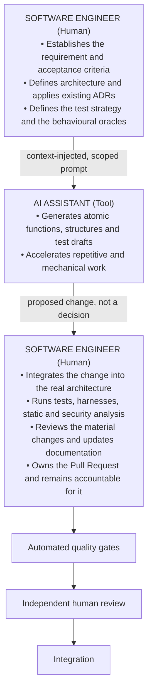

### Design and define

The engineer analyses the business objective, defines acceptance criteria, identifies affected components and security impact, and records architecturally significant decisions as ADRs. Prompts are derived from this work; they do not replace it.

### Integrate

Whether AI output arrives as isolated fragments or as a larger proposed change set, the engineer is responsible for how it lands in the platform: global error handling, centralized logging and telemetry conventions, dependency-injection lifetimes, transaction and concurrency semantics, configuration, resource limits and performance budgets.

### Validate

The engineer is the final authority on whether the change is correct. Validation includes interpreting automated results rather than merely observing that they are green, reviewing the material authored changes, and confirming that the change satisfies the acceptance criteria of the originating requirement.

Generated artifacts — scaffolding, lockfiles, generated clients, schemas, snapshots, bulk fixtures — are validated differently: through the generator and its inputs, the contract they implement and the tests that exercise them, rather than by reading every line. What matters is that somebody decided the generator, the inputs and the expected result, and can say why.

> **The engineer who submits the change is the engineer who answers for it.**

> **Discussion point.** The role description above is a proposal about where engineering attention should move, not a redefinition of anyone's job. It is worth checking against how the teams actually work today.

---

## 11. AI Autonomy Levels

The idea here is that each project states, explicitly, how much autonomy it grants AI development tools, instead of leaving it implicit and discovering it during an incident.

> **Discussion point.** The levels below are a proposed vocabulary. Which level fits which repository class — and whether these four levels map cleanly onto the agent tooling in use — is exactly the kind of thing to settle in review.

### Level 0 — Advisory

AI can:

* Explain code.
* Analyze architecture.
* Suggest changes.
* Propose tests.
* Draft documentation.

AI cannot modify repository files.

---

### Level 1 — Workspace Modification

AI can:

* Modify files in a developer-controlled workspace.
* Generate tests.
* Execute approved local tools.

A developer reviews all modifications before committing them.

---

### Level 2 — Isolated Branch Agent

AI may operate on an isolated working branch where organizational tooling supports it.

The branch:

* MUST NOT be a shared development branch.
* MUST NOT be a release branch.
* MUST NOT be production-related.
* MUST remain associated with a human owner.

Any Pull Request produced by an agent MUST remain subject to human review and approval.

---

### Level 3 — Controlled Engineering Agent

AI may:

* Execute builds.
* Execute tests.
* Execute approved harnesses.
* Perform static analysis.
* Propose fixes.
* Update documentation.
* Prepare a Pull Request.

It MUST NOT cross the human integration boundary.

---

## 12. Repository as Engineering Source of Truth

The repository MUST contain sufficient authoritative information for both developers and AI systems to understand the software.

Recommended structure:

```text
/
├── README.md
├── CONTRIBUTING.md
├── SECURITY.md
│
├── docs/
│   ├── architecture/
│   ├── implementation/
│   ├── testing/
│   ├── security/
│   ├── operations/
│   ├── integration/
│   └── ai/
│
├── ADR/
│
├── src/
├── tests/
├── harness/
├── scripts/
├── tools/
│
├── test-data/
│   ├── fixtures/
│   ├── generators/
│   └── schemas/
│
└── .github/
    └── workflows/
```

The repository SHOULD explain:

* What the system does.
* Its architecture.
* Domain boundaries.
* How it is built.
* How it is tested.
* How it is executed locally.
* How it is deployed.
* Security assumptions.
* External integrations.
* Observability conventions.
* Architectural decisions.
* Engineering constraints.
* AI development rules.

---

## 13. Living Documentation

`/docs` is considered part of the product.

Documentation MUST evolve with the implementation.

Documentation that materially contradicts current implementation is a defect — with the qualification made in the context-economy section: a descriptive document that disagrees with the code is out of date, while an approved specification that disagrees with the code usually means the code has drifted. Both are defects; they are not fixed in the same place.

A code change is therefore incomplete when it changes documented behavior without updating the corresponding documentation.

Recommended structure:

```text
/docs/
├── architecture/
├── implementation/
├── testing/
├── security/
├── operations/
├── integration/
└── ai/
```

Examples:

```text
/docs/architecture/system-overview.md
/docs/architecture/event-flow.md

/docs/implementation/report-generation.md
/docs/implementation/video-processing.md

/docs/testing/e2e-strategy.md
/docs/testing/test-data-strategy.md

/docs/security/authorization-model.md
/docs/security/threat-model.md

/docs/integration/mission-control.md
```

---

## 14. README

The root `README.md` MUST remain the entry point for engineers.

It SHOULD contain:

* Product purpose.
* Architecture summary.
* Repository structure.
* Local setup.
* Build instructions.
* Test execution.
* Required tooling.
* Runtime requirements.
* Configuration.
* Development workflow.
* Links to `/docs`.
* Links to `/ADR`.
* Links to `CONTRIBUTING.md`.
* Quality expectations.

Detailed explanations belong in `/docs`.

---

## 15. Architecture Decision Records

Significant architectural decisions MUST be recorded under:

```text
/ADR
```

An ADR SHOULD contain:

```text
Title
Status
Date
Owners

Context
Problem
Decision
Alternatives Considered
Decision Drivers
Consequences
Security Impact
Operational Impact
Performance Impact
Migration Impact
Observability Impact
Superseded Decisions
References
```

Supported statuses SHOULD include:

```text
Proposed
Accepted
Deprecated
Superseded
Rejected
```

Architectural decisions MUST NOT exist exclusively in:

* AI conversations.
* Chat systems.
* Emails.
* Meeting conversations.
* Developer memory.
* Temporary notes.

AI MAY draft an ADR.

AI MUST NOT accept an ADR.

Architectural authority remains human.

---

## 16. Architecture Guardrails

Before modifying a system, the engineer and AI assistant SHOULD inspect:

1. `README.md`.
2. Relevant architecture documentation.
3. Relevant ADRs.
4. Existing implementation.
5. Existing tests.
6. Public contracts.
7. Domain models.
8. Security constraints.

The AI MUST NOT silently introduce:

* A new architectural pattern.
* A new persistence strategy.
* A new message transport.
* A new authentication mechanism.
* A new authorization model.
* A new dependency injection strategy.
* A new major framework.
* A new cross-cutting abstraction.

When implementation conflicts with an accepted ADR, the conflict MUST be resolved before proceeding.

---

## 17. Versioned AI Engineering Instructions

Reusable engineering rules SHOULD live in the repository, versioned with the code they govern. The complementary half — keeping private, local AI configuration out of it — is the subject of the next section.

Recommended:

```text
/docs/ai/
├── general-engineering.md
├── backend-development.md
├── frontend-development.md
├── testing.md
├── security-review.md
├── refactoring.md
├── database-development.md
├── observability.md
└── documentation.md
```

These instructions represent **engineering knowledge**, not tool-specific prompts.

They SHOULD define:

* Architectural boundaries.
* Framework conventions.
* Dependency rules.
* Error-handling strategy.
* Logging conventions.
* Validation.
* API design.
* Persistence patterns.
* Testing expectations.
* Naming.
* Security requirements.
* Observability.
* Code-quality rules.

---

## 18. Private AI Configuration

Private AI configuration MUST be separated from versioned engineering knowledge.

Examples requiring exclusion or explicit review include:

```text
.claude/
.cursor/
.settings/
.local-ai/
.ai-private/
```

Such locations may accidentally contain:

* API keys.
* Tokens.
* Internal URLs.
* Customer information.
* Local paths.
* Infrastructure details.
* Private prompts.
* Credentials.
* Certificates.
* Security information.

These directories SHOULD normally be excluded through `.gitignore`.

Safe, reviewed, reusable engineering instructions belong under `/docs/ai`, not private local-agent configuration.

Stored prompts, session history and local agent state deserve the same treatment for a second reason: they accumulate organizational context over time, which is the exposure discussed in section 21. Excluding these locations from version control keeps that accumulation out of the repository; it does not by itself limit what was placed in the context to begin with.

---

## 19. AI Context Boundary

Context provided to an AI system MUST follow the principle:

> **Minimum required context.**

Normally acceptable:

```text
README.md
CONTRIBUTING.md
/docs
/ADR
relevant source files
relevant tests
public API contracts
engineering guidelines
sanitized test data
```

Normally prohibited unless specifically authorized:

```text
production credentials
private keys
production certificates
production database dumps
customer PII
secrets
confidential contracts
unrelated repositories
unnecessary infrastructure configuration
```

A large context window MUST NOT be interpreted as permission to provide unnecessary information.

Minimum required context is also the principal preventive control against cumulative exposure: the lists above classify information item by item, but sensitivity is a property of the accumulated context, not only of the individual item. Section 21 develops this as context aggregation risk, and applies it to intellectual property that no single item in the lists above would identify as confidential.

---

## 20. Context-Informed Prompting Protocol

Prompting is an engineering activity that benefits from method. Open-ended prompts tend to produce generic code that ignores the architecture of the system; constrained prompts tend to produce work that fits it and can be reviewed.

### Constraint injection

Every structural prompt SHOULD state, explicitly:

1. The role and stack (framework, language version, runtime).
2. The applicable architectural constraints, referenced by ADR identifier where one exists.
3. The layer and the boundaries the code must respect.
4. The mechanisms that MUST be used (existing abstractions, interfaces, conventions).
5. The mechanisms that MUST NOT be used.
6. The expected error handling, logging and validation behaviour.
7. The expected tests.

**Compliant example**

```text
Act as a senior .NET engineer working under ADR-2026-04 (event-driven isolation).
Write a command handler that processes an invoice.
Constraints:
- Do not instantiate or inject a DbContext in this handler.
- Publish all state changes through the existing IEventBus abstraction.
- Use the project's Result<T> error type; do not throw for expected validation failures.
- Log through the existing ILogger abstraction; no new telemetry conventions.
- Provide xUnit tests covering the invalid-invoice and duplicate-event cases.
```

**Non-compliant example**

```text
Write me an invoice processing service.
```

### Decomposition, and feature-scale work

The behaviour worth ruling out is the unconstrained one:

> Complete features MUST NOT be implemented as a single unconstrained generation step whose output is accepted wholesale.

That is different from saying an assistant may not work at feature scale. A capable agent can carry a complete feature when the work is decomposed, a plan exists, checkpoints are verified as it proceeds, and a human controls the result. What makes it acceptable is the structure around it, not the size of the task:

1. The engineer establishes the requirement, the acceptance criteria and the architectural constraints.
2. The work is broken into units that can be verified independently.
3. The assistant implements a unit; tests and checks run at that checkpoint.
4. The engineer inspects the result before the next unit builds on it.
5. Integration into the architecture, and responsibility for the whole, stay with the engineer.

The purpose is to keep the diff reviewable and to localize the blast radius of an incorrect assumption — the same intent as the small-batch section elsewhere in Part I.

> **Discussion point.** Where the line falls between "planned and checkpointed feature-scale work" and "one unconstrained generation step" deserves a concrete definition, ideally expressed as what a checkpoint has to produce.

### Comprehension of what is submitted

The proposed expectation is that an engineer who submits AI-generated code can explain, during review, every **material authored change** it contains, including:

* Why each dependency and abstraction is used.
* The failure modes and error paths.
* The concurrency, transaction and lifetime assumptions.
* The security implications.
* Why the chosen approach is appropriate for this system.

If a material part of the change cannot be explained by its human owner, the reasonable default is that it does not merge until it can.

**Generated artifacts are a separate case.** Migration scaffolding, generated API clients, schemas, lockfiles, snapshots and bulk fixtures are not read line by line by anyone, and a rule that pretends otherwise is one people quietly ignore. The suggestion is to hold a different expectation for them: the engineer chose the generator and its inputs, can explain what it produces and why, and the output is validated by contract, schema or test rather than by reading. Anything hand-edited afterwards returns to being a material authored change.

> **Discussion point.** Which categories count as generated artifacts differs per stack, and the boundary is worth writing down per repository rather than in the abstract.

### Session hygiene

* Context provided to an assistant MUST respect the AI context boundary described in Part I.
* Long sessions SHOULD be restarted when the assistant begins contradicting known constraints, as accumulated context increases drift. Accumulated context also raises a confidentiality question, addressed as context aggregation risk in section 21.
* Statements produced by an assistant about the state of the repository, the behaviour of a dependency or the result of a command MUST be verified against the repository or the command output before being acted upon.

---

## 21. Agentic Security Boundary

Agentic AI introduces additional risk because generated instructions may cause actions, not merely text generation.

AI agents MUST therefore treat repository content, tool output, external documents, issue descriptions and imported data as potentially untrusted input.

In particular, systems SHOULD protect against:

* Prompt injection.
* Indirect prompt injection.
* Tool misuse.
* Excessive agency.
* Credential exposure.
* Unauthorized data access.
* Malicious repository instructions.
* Unsafe shell commands.
* Unauthorized network access.
* Cross-repository data leakage.
* Progressive disclosure of intellectual property through accumulated context.
* Dependency substitution.
* Exfiltration through generated output.

Agent instructions discovered inside source code, documentation, tickets or external content MUST NOT automatically override organizational policy.

Tool permissions SHOULD be allow-listed wherever practical.

### Context aggregation and progressive intellectual-property disclosure

Confidentiality risk is not limited to exposing a complete secret, document, algorithm or dataset in a single prompt. A sequence of individually harmless and incomplete disclosures MAY collectively reveal proprietary knowledge, because modern AI systems correlate information across large contexts and infer relationships between fragments.

An assessment performed prompt by prompt therefore measures the wrong thing.

> **Context aggregation risk:** information that is non-sensitive in isolation may become sensitive when combined with other information. AI context MUST therefore be evaluated cumulatively, not prompt by prompt.

> **Minimum necessary context:** engineers MUST provide an AI system only the minimum organizational information required to perform the specific engineering task.

> **The security boundary is determined not only by what is explicitly disclosed, but also by what a sufficiently capable model may reasonably infer from the accumulated context.**

This document uses **context aggregation risk** for the exposure mechanism and **progressive IP disclosure** for the resulting failure mode. The same pattern is sometimes described informally as "IP juicing"; that term has no established technical definition and is not used here as the formal one.

Fragments that are unremarkable individually but correlatable in combination include:

* Previous prompts and accumulated conversation context.
* Other source-code fragments.
* Architecture information.
* Internal terminology.
* Business rules.
* Algorithms.
* Data models and schemas.
* Infrastructure details.
* Product behavior.
* Performance characteristics.
* Customer-specific information.
* Documentation or ADR fragments.
* Information obtained from other repositories or organizational systems.

#### Protected information

The knowledge this control protects extends beyond credentials and personal data, and includes, where applicable:

* Proprietary algorithms.
* Source code.
* Internal architectures.
* Trade secrets.
* Product designs.
* Industrial know-how.
* Proprietary business rules.
* Internal protocols.
* Security mechanisms.
* Manufacturing or engineering processes.
* Confidential customer solutions.
* Unpublished research.
* Patent-sensitive technical information.

The risk applies even when no single prompt contains the complete protected information.

This is deliberately broader than the prohibition on secrets and personal data stated among the hard limits in section 9 and repeated in the context boundary in section 19. A context can contain no credentials, no keys and no customer PII, and still describe how the product works well enough to be reconstructed. Removing the obvious secrets is a necessary control, not a sufficient one.

#### Distinguishing what enters the context

Not every source-code fragment is prohibited from AI use, and the objective is risk-based protection rather than making AI-assisted development impractical. Before adding material to a session, engineers SHOULD place it in one of three categories:

1. **Required** — information the engineering task genuinely needs. This is provided.
2. **Unnecessary** — information that does not contribute to the task. This is not provided, regardless of how much context the model can hold.
3. **Cumulatively sensitive** — information that is defensible in isolation but that, combined with what the session already contains, approaches a reconstruction of protected knowledge. This requires a deliberate decision, and often a new session instead.

The third category is the one this section exists for. It is also the one that is easy to miss, because each individual step looks reasonable.

#### Controls

Engineers MUST NOT knowingly use AI systems in a way that enables progressive reconstruction, inference or extraction of confidential organizational or third-party intellectual property.

In addition:

* Engineers MUST consider the cumulative sensitivity of a session before adding new information to it.
* Only organization-approved AI tools and providers MUST be used for proprietary engineering information. The general requirement appears among the hard limits in section 9; it matters again here because provider retention and training terms determine what happens to an accumulated context after the session ends. Where the accumulated context is unavoidably rich, the structural answer is to keep inference and tool access inside the organization, as described in section 23.
* Cross-repository context MUST be treated as a privileged operation, justified by the task rather than by convenience.
* Redaction of obvious secrets MUST NOT be assumed to protect intellectual property.
* Context supplied to an AI system SHOULD be minimized to what the task requires.
* Abstractions, interfaces, contracts and reduced examples SHOULD be preferred over complete implementations where they are sufficient for the task.
* Proprietary identifiers, internal names and domain terminology SHOULD be sanitized or generalized where they are not necessary for the task.
* Unrelated repository content SHOULD NOT be supplied.
* Persistent sessions accumulating information from unrelated confidential tasks SHOULD be avoided.
* A new context or session SHOULD be started when separation between tasks is required, and MAY be started at any point when the accumulated context is no longer justified by the current task.

Work that touches core industrial know-how, patent-sensitive material or confidential customer solutions SHOULD be scoped explicitly before an assistant is involved, so that the decision about what may enter the context is made once and deliberately rather than incrementally under delivery pressure.

> **Discussion point.** This is the section most likely to be either over-applied or ignored. Two things would make it practical: a short, concrete list per repository of what counts as cumulatively sensitive in that codebase, and agreement on when starting a fresh session is expected rather than merely advisable.

---

## 22. Shell and Tool Execution

AI agents capable of executing commands SHOULD run inside a constrained environment.

High-risk actions require explicit human control.

Examples include:

```text
rm
git reset --hard
git push --force
database destructive commands
infrastructure changes
credential operations
package publication
container registry publication
deployment commands
```

Automatic approval of command execution MUST NOT be enabled for work on organizational repositories or systems. Section 23 covers auto-approval modes and the curated allow-list that replaces them.

Command output MUST be treated as evidence, not as truth beyond what the command actually verifies.

---

## 23. Local Models and Organization-Owned Agentic Tooling

The controls in the preceding sections constrain what may be placed in an AI context, largely because that context usually leaves the organization. When inference and tool access stay inside the organizational boundary, the underlying risk changes shape: the question stops being *what did we disclose to a third party* and becomes *what did we allow an automated actor to reach and to do*.

This section takes a deliberately positive position. **Building an internal ecosystem of local models and organization-owned tool integrations is permitted and actively advisable**, and is the preferred deployment for engineering work that touches proprietary context. It is the most effective structural answer to the context aggregation risk described in section 21: context that never crosses the boundary cannot be accumulated on the other side of it.

Being inside the boundary is not, however, a general exemption. A local agent with broad credentials is a different risk, not a smaller one.

### The pattern this section describes

A corporate identity, a scoped credential, an organization-owned integration layer — Model Context Protocol (MCP) servers or an equivalent tool interface — and a model whose inference runs on organization-controlled infrastructure.

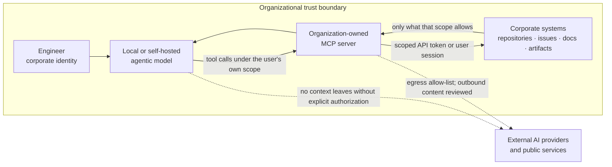

A concrete and useful example: an internal MCP server that connects a local agentic model to the organization's GitHub through an API token, giving it read access to designated repositories and branches so that it can answer questions, analyse code, prepare changes and draft documentation — while destructive and overwriting operations remain outside the tool surface, and the harnesses prevent anything sensitive from being published outward without permission.

Such an ecosystem SHOULD be treated as engineering infrastructure: designed, reviewed, versioned and operated, not assembled ad hoc on individual workstations.

### Identity and authorization

* An agent MUST act under an identifiable corporate identity — the human user's, or a dedicated service identity whose scope is equal to or narrower than that of the human owner.
* An agent MUST NOT exceed the access level that the corresponding corporate account already has. The integration is a convenience layer over existing authorization, never a way around it.
* Shared, long-lived or organization-wide tokens MUST NOT be used to back agent tooling. Credentials SHOULD be scoped to the smallest useful set of repositories, projects and operations, SHOULD be short-lived, and MUST be revocable.
* Credentials MUST NOT be placed in prompts, context files, repository content or agent configuration committed to version control. This is the same separation required in section 18.
* Where the tooling supports it, access SHOULD be scoped per task rather than granted permanently, so that the credential reflects the work actually being done.

### Read, write and destructive operations

The asymmetry between reading and changing is the most important design decision in an internal agent ecosystem.

* Tool surfaces SHOULD be **read-only by default**. Write capability is added deliberately, per repository and per operation.
* Destructive and overwriting operations MUST be excluded from the agent's tool surface, or gated behind an explicit human confirmation for each invocation. These include, at minimum: force push, history rewrite, branch or tag deletion, protected-branch modification, repository or project settings changes, workflow and CI configuration changes, secret creation or rotation, release publication, package or image publication, issue and Pull Request deletion, and any mutation of production data.
* Write access MUST NOT extend to protected branches. The integration boundary defined in section 8.2 is unchanged by the fact that the model runs locally: an internal agent may prepare a change and open a Pull Request, and MUST NOT approve, merge or release it.
* Access SHOULD be scoped to specific repositories and branch patterns rather than to an organization as a whole. Cross-repository reach remains a privileged operation, for the reasons given in section 21.
* Bulk read operations — cloning entire organizations, enumerating all repositories, exporting complete issue histories — SHOULD be treated as privileged even when read-only, because their value to an attacker and their aggregation effect are both high.

### Automatic approval modes

Most agentic tools offer a mode that stops asking: auto-approve, auto-accept, "always allow", unattended or "auto" mode. It is the single setting that most changes the risk profile of an agent, because it converts a misreading, a hallucinated command or an injected instruction into an executed action chain with nobody in the path.

* Blanket automatic approval MUST NOT be enabled when an agent operates on organizational repositories, systems or data. Tool invocations that execute commands, modify files outside a scratch area, or change remote state require a human decision.
* This applies with particular force to shell execution. Long, chained or generated-on-the-fly command lines are exactly the case where a human check is cheapest and its absence is most expensive — a single command can delete work, rewrite history, or reach the network.
* A **curated allow-list is not auto mode**, and is the acceptable middle ground: specific, non-destructive, well-understood operations approved in advance — reading files, `git status` and `git diff`, running the project's tests or build inside the workspace — so that confirmation fatigue does not push engineers into switching approvals off entirely. The allow-list is explicit, reviewed, revocable and narrow; anything outside it prompts.
* Confirmation MUST NOT be reduced to a reflex. A prompt that is always accepted without reading provides no control, which is why the allow-list above exists: to make the prompts that do appear worth reading.
* Genuinely unattended operation — a scheduled agent, a CI-triggered agent — MAY be justified, but is an exception rather than a default. Where it is used it SHOULD run under a dedicated identity with read-only or narrowly scoped write access, inside the constrained environment of section 22, never against protected branches, with its actions logged and its output entering through a Pull Request like any other change.

This is the same reasoning as the excessive-agency concern in section 21, applied to a configuration switch rather than to a design decision.

### Egress and exfiltration control

A component that can both read internal data and reach external endpoints is an exfiltration path, whether or not anyone intended it to be one.

* Read access to internal systems and the ability to reach external endpoints SHOULD be separated across different tools, credentials or servers, so that no single tool holds both halves of that path.
* Outbound network access from agent tooling SHOULD be allow-listed. Arbitrary outbound HTTP from an MCP server is not an acceptable default.
* Any operation that would publish content outside the organization — external issues, public repositories, gists, package registries, third-party services, external documentation — MUST require explicit human authorization for that specific publication, and SHOULD pass secret scanning and sensitive-content checks before it leaves.
* Harnesses and pipeline controls MUST be positioned so that they can block outward publication of sensitive information, not merely record it after the fact.
* Where an agent can post to systems that other people or agents read — issue comments, wiki pages, generated documentation — that output SHOULD be treated as a potential injection channel as well as a potential leak, consistent with section 21.

### Inference locality

* Inference on proprietary engineering context SHOULD run on organization-controlled infrastructure: on the engineer's machine, on organization-operated servers, or in a dedicated isolated environment under organizational control.
* Silent fallback to an external provider MUST NOT occur. Where a deployment can route to an external model, that routing MUST be explicit, visible to the engineer at the time, and subject to the same context rules as any other external assistant.
* Prompt logs, tool-call traces and conversation history accumulated by internal tooling MUST be treated as organizational data: retained deliberately, access-controlled, and covered by a retention policy. These stores are themselves an accumulation of context in the sense of section 21.
* Model weights, adapters and fine-tuning datasets derived from proprietary material MUST be handled as proprietary assets, including for storage location, access control and disposal.

### The tooling is itself a dependency

MCP servers, agent frameworks, plugins and model artifacts enter the engineering environment with unusually high privilege. They are subject to the dependency governance requirements of section 24, and additionally:

* Third-party MCP servers and agent plugins SHOULD be reviewed before installation, pinned to specific versions, and obtained from verified sources.
* Tool definitions, tool descriptions and tool output MUST be treated as untrusted input. A tool description is text that reaches the model, and is therefore an injection surface as described in section 21.
* Agent tooling SHOULD run in the constrained execution environment described in section 22.
* An internally built MCP server is a production service in security terms, and SHOULD receive design review, code review, authentication, authorization, logging and dependency maintenance accordingly.

### Auditability

* Tool invocations SHOULD be logged with the acting identity, the tool, the target, the parameters (with sensitive values redacted) and the outcome.
* Logs SHOULD be retained for a defined period and be reviewable during incident investigation, consistent with the audit trail described in the compliance section.
* Destructive operations that were permitted by exception SHOULD be individually traceable to the human who authorized them.

### What this does not change

An internal deployment relaxes the constraints on *context*, not the constraints on *integration*. Everything else in Part I continues to apply unchanged: the autonomy levels in section 11, the Pull Request boundary, the quality gates, human review, and the rule that only a human decides when software crosses into a shared branch.

It also does not make every task an internal-tooling task. External assistants remain reasonable for work whose context is genuinely non-proprietary — public APIs, generic boilerplate, general language questions, documentation phrasing — under the context boundary in section 19. The distinction worth institutionalizing is:

1. Proprietary context, sensitive know-how, customer-specific solutions, security mechanisms → internal ecosystem, by preference.
2. Non-proprietary context → either, under the ordinary context rules.
3. Any context at all → the integration boundary and the human accountability model are identical in both cases.

> **Discussion point.** Three things need deciding before this becomes real: what "local" means for us in each case (engineer workstation, on-premises server, or an isolated tenant we control), who builds and operates the MCP layer and with what capacity, and which teams and stacks go first. The security position above is the easy part; the operational ownership is what determines whether this exists in practice.

---

## 24. Dependency Governance

AI MUST NOT introduce dependencies simply because a generated answer references them.

Every new dependency SHOULD be validated for:

* Actual existence.
* Correct package identity.
* Maintainer reputation.
* License compatibility.
* Security advisories.
* Maintenance activity.
* Compatibility.
* Necessity.
* Dependency-tree impact.

Typosquatting and hallucinated package names MUST be considered explicit AI-development risks.

Prefer existing project dependencies when they provide the required capability.

---

## 25. Implementation Planning

Before implementation, a task SHOULD identify:

* Functional requirements.
* Acceptance criteria.
* Affected components.
* Relevant ADRs.
* Security impact.
* Required tests.
* Documentation impact.
* API impact.
* Persistence impact.
* Migration impact.
* Performance impact.
* Observability impact.
* Compatibility requirements.

Significant changes SHOULD have an implementation plan:

```text
/docs/implementation/<ticket-id>-implementation-plan.md
```

The plan SHOULD describe:

1. Problem.
2. Proposed solution.
3. Components affected.
4. Expected data flow.
5. API changes.
6. Persistence changes.
7. Security considerations.
8. Failure scenarios.
9. Test strategy.
10. Deployment/migration concerns.
11. Rollback approach.

---

## 26. Small-Batch AI Development

AI-assisted modifications work better small — not because a capable agent cannot handle more, but because a change is accepted at the speed it can be understood.

Large unconstrained generation makes review harder and increases the probability that architectural or behavioral inconsistencies remain unnoticed.

Prefer:

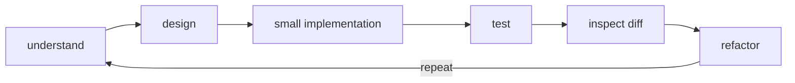

over:

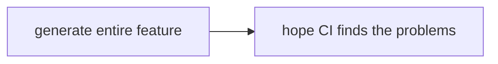

Reviewability is the constraint that matters. Feature-scale work is compatible with it when it is decomposed and checkpointed, as described in the prompting section; what is not compatible with it is a single large generation accepted in one piece.

---

## 27. Verification Independence

An important AI-specific rule is:

> **The implementation and the evidence proving the implementation should not rely exclusively on the same reasoning path.**

AI MAY generate both production code and tests.

However, critical behavior SHOULD also be anchored by at least one independent oracle such as:

* Human-defined acceptance criteria.
* Existing specification.
* API contract.
* Schema.
* Mathematical invariant.
* Domain invariant.
* Golden dataset.
* Regression fixture.
* Independent implementation.
* Property-based test.
* Previously validated behavior.

A test generated from an incorrect AI assumption can reproduce the same incorrect assumption and therefore falsely validate the implementation. The same applies to asking an assistant to check its own work, for the reasons given in section 6.

Passing self-generated tests alone is not sufficient evidence for critical behavior.

---

## 28. Risk-Based Test Portfolio

Projects SHOULD maintain a test portfolio appropriate to their architecture rather than blindly optimizing for a fixed test pyramid.

The portfolio may include:

```text
Unit tests
Component tests
Integration tests
Contract tests
Property-based tests
Regression tests
End-to-End tests
Security tests
Performance tests
Resilience tests
Migration tests
Compatibility tests
```

The appropriate combination depends on:

* Business risk.
* Architectural boundaries.
* Cost of failure.
* Integration complexity.
* Change frequency.
* Security relevance.

---

## 29. Unit Tests

Unit tests SHOULD:

* Remain fast.
* Remain deterministic.
* Test behavior rather than implementation detail.
* Focus on business rules.
* Include boundary conditions.
* Avoid unnecessary mocking.
* Produce useful failure messages.

Tests SHOULD NOT be changed simply to make an incorrect implementation pass.

When existing behavior changes intentionally, the requirement must justify the corresponding test change.

---

## 30. Integration Tests and Real Dependencies

Where practical, integration tests SHOULD use real implementations of important infrastructure dependencies rather than behavioral imitations.

Examples:

* PostgreSQL.
* Redis.
* RabbitMQ.
* Kafka.
* Keycloak-compatible identity services.
* Object storage.
* Real serialization mechanisms.

Ephemeral containerized dependencies are preferred when they improve reproducibility and isolation.

Each test environment SHOULD start from a known state.

Shared mutable integration environments SHOULD be avoided because they introduce configuration drift and non-determinism.

---

## 31. Contract Testing

Distributed architectures SHOULD consider automated contract testing.

Contract tests are particularly appropriate for:

* REST APIs.
* Event contracts.
* Microservices.
* Frontend/backend integration.
* Independently deployable services.

Where applicable, consumer/provider contracts SHOULD be validated during CI.

Contract compatibility can detect integration breakage earlier and more efficiently than relying exclusively on broad End-to-End suites.

---

## 32. End-to-End Tests

E2E tests SHOULD validate high-value business workflows.

They SHOULD NOT become the primary mechanism for validating every possible behavior.

Good E2E candidates include:

* Authentication.
* Authorization.
* Critical workflows.
* Cross-service flows.
* Persistence.
* Main user journeys.
* Regression scenarios affecting several components.

E2E test failures MUST produce enough information to diagnose the affected step.

---

## 33. Test Maintenance

Tests are production engineering assets.

They MUST be maintained with the same discipline as implementation code.

The team SHOULD regularly identify:

* Flaky tests.
* Duplicate tests.
* Obsolete tests.
* Slow tests.
* Tests without meaningful assertions.
* Excessive mocks.
* Tests coupled to implementation details.
* Uncovered business invariants.

A test SHOULD NOT be removed merely because an AI-generated implementation causes it to fail.

The engineer must first determine whether:

1. The test is incorrect or obsolete.
2. The requirement changed.
3. The implementation contains a regression.

---

## 34. AI-Assisted Test Generation

AI is particularly useful for expanding test coverage.

AI MAY propose:

* Boundary conditions.
* Invalid inputs.
* Failure cases.
* Property-based tests.
* Security cases.
* Concurrency scenarios.
* State transitions.
* Regression cases.
* Contract tests.
* Mutation candidates.

However:

> **Generated test quantity is not a quality metric.**

Test quality depends on the behaviors and risks detected, not the number of test cases produced.

---

## 35. AI-Generated Mock and Synthetic Test Data

AI MAY generate synthetic or mock data when real data is unnecessary, unavailable, sensitive, expensive or operationally difficult to obtain.

Examples include:

* API responses.
* Database fixtures.
* Domain entities.
* Events.
* Files.
* Telemetry.
* Images.
* Inspection measurements.
* Error cases.
* Edge cases.

Generated data MUST respect the actual domain constraints.

---

## 36. Synthetic Data Safety Rules

Synthetic data used for testing SHOULD be:

* Artificial.
* Reproducible.
* Clearly identified.
* Schema-valid.
* Domain-valid where required.
* Free from production credentials.
* Free from real customer PII.
* Free from confidential information.

Production datasets MUST NOT simply be provided to an external AI model for transformation into "mock data".

Where production-derived data is required, an approved sanitization or anonymization process MUST precede AI processing.

---

## 37. Synthetic Data Provenance

Important generated datasets SHOULD record how they were produced.

Recommended metadata includes:

```text
generator
generator version
generation date
schema version
seed
scenario
constraints
source classification
validation status
```

For deterministic generators, a seed SHOULD be stored.

Example:

```json
{
  "generator": "inspection-fixture-generator",
  "version": "1.4.0",
  "seed": 381902,
  "schema": "scan-zone-v3",
  "scenario": "corrosion-boundary-cases",
  "containsRealCustomerData": false
}
```

This allows failures to be reproduced.

---

## 38. Scenario-Based Test Data

Synthetic data SHOULD not be generated randomly without engineering purpose.

Datasets SHOULD represent scenarios such as:

```text
nominal
minimum
maximum
empty
invalid
duplicate
out-of-order
partial
corrupted
expired
unauthorized
high-volume
concurrent
legacy-version
future-compatible
```

Domain-specific scenarios SHOULD also be documented.

---

## 39. Synthetic Data Validation

AI-generated test data MUST be validated before it becomes authoritative test input.

Validation may include:

* JSON Schema.
* OpenAPI validation.
* Database constraints.
* Domain invariants.
* Statistical constraints.
* File-format validation.
* Referential integrity.
* Range checking.

AI-generated data that violates the underlying domain can produce meaningless test confidence.

---

## 40. Golden and Regression Datasets

Complex transformations SHOULD maintain curated golden datasets where appropriate.

Typical cases include:

* Image processing.
* Data ingestion.
* Report generation.
* Serialization.
* Geometry.
* Numerical algorithms.
* Protocol conversion.
* Migration.

Golden datasets SHOULD be deliberately reviewed.

AI MAY expand them.

AI MUST NOT silently rewrite the expected result solely to make a regression disappear.

---

## 41. Property-Based and Invariant Testing

Where applicable, important business properties SHOULD be expressed independently from concrete examples.

Examples:

```text
authorization never crosses tenant boundaries
serialization round-trip preserves the domain value
sorting never changes the item set
retry does not duplicate a committed operation
migration preserves all valid entities
```

Property-based testing is particularly useful for AI-assisted development because it checks a broader input space than examples generated during the same reasoning session.

---

## 42. Mutation Testing

For high-risk logic, teams SHOULD consider mutation testing or equivalent techniques to evaluate whether tests can actually detect incorrect implementations.

Coverage indicates that code executed.

It does not prove that assertions would detect a defect.

Mutation analysis can reveal apparently well-covered code whose tests do not meaningfully validate behavior.

---

## 43. Test Harnesses

Repositories SHOULD contain deterministic harnesses capable of verifying system behavior independently of developer interpretation.

Recommended:

```text
/harness/
├── api/
├── integration/
├── contracts/
├── security/
├── performance/
├── migration/
└── regression/
```

Harnesses may validate:

* API behavior.
* Database migrations.
* Data ingestion.
* Serialization.
* Business rules.
* Authorization.
* Authentication.
* Tenant isolation.
* File processing.
* Event processing.
* External integrations.
* Performance thresholds.
* Regression behavior.

Harnesses SHOULD run automatically in CI where practical.

---

## 44. Harness Independence

Harness expectations SHOULD preferably be defined from specifications, contracts or known invariants.

The implementation under test MUST NOT silently redefine its own acceptance oracle.

For critical workflows, the same AI session SHOULD NOT be considered sufficient authority for:

1. Requirement interpretation.
2. Implementation.
3. Test oracle.
4. Acceptance decision.

Human-defined requirements and independent executable checks create the necessary separation.

---

## 45. Static Quality Analysis

Static analysis SHOULD form part of the mandatory quality boundary.

Where SonarQube is used, the Pull Request MUST satisfy its configured Quality Gate.

Particular emphasis SHOULD be placed on **new code**.

Controls SHOULD include:

* Bugs.
* Vulnerabilities.
* Security hotspots.
* Maintainability.
* Reliability.
* Duplication.
* Complexity.
* Coverage.

Existing legacy debt SHOULD not justify introducing new debt.

---

## 46. Automated Quality Gates: Proposed Model

The boundaries described in Part I are easier to hold with automation than with intention. The proposal is that each repository using AI-assisted development runs an automated quality gate on Pull Requests, of roughly this shape:

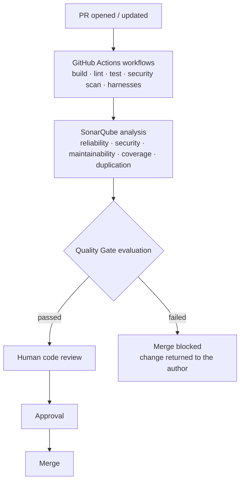

The automated gate is a **necessary** condition for merge. It is never a **sufficient** one: human review remains mandatory in all cases.

### Suggested branch protection

The following seem worth enforcing technically on `main`, `release/*` and the shared development branch, rather than only documenting:

* **No direct pushes.** All changes enter through a Pull Request.
* **Required status checks.** All applicable workflows and the SonarQube Quality Gate MUST report success before a Pull Request becomes mergeable.
* **Required human approval.** At least one approving review from an engineer other than the author. Security-sensitive, architectural or migration changes SHOULD require a second reviewer with the relevant competence.
* **Dismiss stale approvals** when new commits are pushed.
* **Conversation resolution required** before merge.
* **Linear history and up-to-date branches** where the branching model supports it.
* **No force pushes and no branch deletion** on protected branches.
* **Restricted bypass.** Administrative bypass SHOULD be disabled; where it is retained for emergency use it MUST be logged and reviewed as described in the compliance section.

### Workflow security

CI configuration is itself part of the attack surface, and a frequent target of AI-generated shortcuts:

* Workflows analysing untrusted contributions MUST NOT use `pull_request_target` with a checkout of the contributor's code while holding repository secrets.
* Actions SHOULD be pinned to a released major version at minimum, and to a commit SHA for security-critical actions.
* Workflow `permissions` SHOULD be declared explicitly and minimally (`contents: read` by default).
* Secrets MUST be provided through the secret store; they MUST NOT appear in workflow files, logs, cached artifacts or generated code.
* Workflow definitions changed by an AI assistant MUST receive the same review scrutiny as production code.

### Thresholds

Concrete thresholds — coverage, duplication, ratings — are deliberately **not** in Part I. They are proposed in **Annex B** so that they can be argued about, adjusted per stack and changed over time without reopening the standard.

> **Discussion point.** The right question for Part I is whether a repository should have a gate at all and what it protects; the right question for Annex B is what the numbers are. Keeping them apart is itself a proposal.

---

## 47. Clean Code Requirements

AI-generated code MUST follow the same standards as manually produced code.

Expected characteristics include:

* Small cohesive functions.
* Explicit intent.
* Clear naming.
* Single responsibility.
* Appropriate abstraction.
* Clear domain boundaries.
* Controlled side effects.
* Explicit error handling.
* Dependency inversion where appropriate.
* Minimal duplication.
* No dead code.
* No commented-out code.
* No speculative abstractions.
* No unnecessary dependencies.

Prefer:

> **The simplest design that correctly satisfies the known requirements and existing architecture.**

Avoid speculative architecture generated to solve hypothetical future requirements.

---

## 48. Security Verification

AI-assisted changes MUST preserve secure development practices.

Depending on system risk, CI SHOULD include:

* Secret scanning.
* SAST.
* Dependency scanning.
* Software Composition Analysis.
* Container scanning.
* IaC scanning.
* Authentication tests.
* Authorization tests.
* Tenant-isolation tests.
* Input validation tests.

Security-sensitive changes require explicit human security review.

---

## 49. Threat Modeling

Relevant features SHOULD include threat analysis.

Threat modeling SHOULD consider:

* Assets.
* Trust boundaries.
* Identities.
* Permissions.
* External inputs.
* Network boundaries.
* Data classification.
* Abuse cases.
* Failure modes.

For AI-enabled functionality, also consider:

* Prompt injection.
* Data poisoning.
* Sensitive-information disclosure.
* Excessive agency.
* Tool abuse.
* Unauthorized action chaining.

---

## 50. Software Supply Chain

The engineering pipeline SHOULD provide visibility into software composition and artifact provenance.

Where organizational maturity permits, builds SHOULD generate an SBOM using a recognized format such as:

* CycloneDX.
* SPDX.

Release artifacts SHOULD be traceable to:

* Source revision.
* Build workflow.
* Dependencies.
* Build environment.
* Produced artifact.

---

## 51. Artifact Provenance and Signing

Higher-assurance systems SHOULD generate verifiable build provenance and SHOULD consider signing release artifacts.

The organization SHOULD progressively adopt software-supply-chain controls consistent with frameworks such as SLSA.

Where signing is implemented, artifacts may include:

* Container images.
* Binaries.
* Packages.
* SBOMs.
* Build attestations.

The objective is to establish:

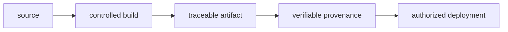

---

## 52. Observability

Relevant functionality SHOULD expose appropriate:

* Logs.
* Metrics.
* Traces.
* Audit events.

Existing OpenTelemetry conventions SHOULD be followed where defined.

AI MUST NOT create alternative telemetry conventions when the project already has one.

Logging MUST NOT expose:

* Credentials.
* Authentication tokens.
* Private keys.
* Sensitive personal data.
* Confidential payloads.

---

## 53. API Changes

API changes MUST include:

* Implementation.
* Automated tests.
* OpenAPI update where applicable.
* Contract validation.
* Compatibility evaluation.
* Integration documentation.

Breaking API changes SHOULD normally require architectural review and potentially an ADR.

---

## 54. Database Changes

Database changes MUST include:

* Explicit migration.
* Migration test.
* Migration review.
* Compatibility analysis.
* Rollback consideration.
* Appropriate integration testing.

Production database manipulation MUST remain outside autonomous AI authority.

---

## 55. AI-Assisted Refactoring

AI is particularly effective at systematic refactoring, but refactoring MUST preserve behavior unless requirements explicitly change.

Before significant refactoring:

1. Establish or verify regression tests.
2. Identify behavioral invariants.
3. Perform small changes.
4. Re-run tests after each meaningful step.
5. Inspect the resulting diff.

A large AI rewrite without behavioral protection SHOULD NOT be accepted as routine refactoring.

---

## 56. AI Contribution Traceability: Options

Some traceability of AI-assisted development is useful for auditability and for understanding how a change came to be. The open question is what to record.

**A simple boolean has a short shelf life.** Recording `AI assistance: yes / no` works while assistance is the exception. If, within a couple of years, nearly all development carries some degree of assistance, the field stops discriminating anything and becomes a box everyone ticks.

**Recording the kind and degree of intervention is likely to age better.** Categories that would actually change how a reviewer approaches the change:

```text
AI agent generated a substantial part of this change
AI-generated tests
AI-generated synthetic or fixture data
AI-assisted data or schema migration
AI-assisted change to security-sensitive code
AI-assisted change to CI, infrastructure or deployment configuration

Human owner: <developer>
Verification performed: <checks executed and evidence reviewed>
```

Whatever is chosen, two things seem worth keeping in view: the declaration should be cheap for the author, and anything derivable automatically — from commit trailers, agent tooling or branch metadata — is better derived than asked.

The purpose would be auditability rather than attribution: understanding how a change came to be, and being able to look again at the changes where the process carried more risk. Prompts and confidential AI conversations are not what should be archived.

Annex C sketches how this could look in a Pull Request template, as material for the discussion.

> **Discussion point.** This needs consensus before it goes into a template. The categories above are a first proposal, not a decision, and the alternative of recording nothing at all — relying on review and ownership instead — is also a legitimate position to argue.

---

## 57. AI Review as Additional Review

AI code review MAY complement human review.

It MUST NOT replace required human approval.

AI review is useful for:

* Suspicious patterns.
* Missing validation.
* Repetition.
* Potential bugs.
* Documentation inconsistencies.
* Test suggestions.

The human reviewer remains responsible for architectural and domain correctness.

---

## 58. Pull Request Boundary

Every change entering a protected shared development branch MUST use a Pull Request.

Direct pushes SHOULD be technically disabled.

The Pull Request is the principal integration quality boundary.

---

## 59. Pull Request Acceptance Criteria

A Pull Request may be merged only when all applicable criteria are satisfied:

* Code builds.
* Required tests pass.
* Integration tests pass.
* Contract tests pass where required.
* Harnesses pass.
* Static analysis passes.
* SonarQube Quality Gate passes where applicable.
* Security checks pass.
* No secrets are introduced.
* Documentation is updated.
* ADRs are updated if architecture changed.
* OpenAPI is updated if contracts changed.
* Database migrations are reviewed.
* Observability impact is considered.
* Compatibility is evaluated.
* Ticket acceptance criteria are verified.
* Human review is complete.

---

## 60. Pull Request Checklist

```text
[ ] AI assistance declared (scope and human owner)
[ ] Material authored changes reviewed and explainable by the author
[ ] Generated artifacts identified and validated by generator, contract or tests
[ ] Requirement implemented
[ ] Acceptance criteria verified
[ ] Architecture respected
[ ] Relevant ADRs reviewed
[ ] Unit tests added or updated
[ ] Integration tests added or updated
[ ] Contract tests added where applicable
[ ] E2E tests added where applicable
[ ] Security cases considered
[ ] Tests pass
[ ] Required harnesses pass
[ ] Quality Gate passes
[ ] No credentials or secrets introduced
[ ] New dependencies reviewed
[ ] Documentation updated
[ ] README updated if required
[ ] API documentation updated if required
[ ] Database migration reviewed
[ ] Observability reviewed
[ ] Compatibility reviewed
[ ] Human code review complete
```

The checklist would be automated wherever possible rather than depending on developer memory. It is also long: part of the review is deciding which items earn their place and which are ceremony.

---

## 61. Human Review

Human review is mandatory.

A reviewer MUST NOT merely confirm that CI is green.

Review SHOULD evaluate:

* Correctness.
* Domain behavior.
* Architectural alignment.
* Security.
* Maintainability.
* Error handling.
* Performance.
* Test quality.
* Complexity.
* Observability.
* Dependency impact.

Particular attention SHOULD be paid to AI-specific failure modes including:

* Invented APIs.
* Hallucinated packages.
* Incorrect library usage.
* Hidden assumptions.
* Security bypasses.
* Missing edge cases.
* Overengineering.
* Incorrect concurrency assumptions.
* Silent behavior changes.
* Tests that merely mirror implementation assumptions.

---

## 62. Branch Management

The branching model itself is a team decision, and the one below is simply the model this draft assumes. What the document argues for is narrower: that AI-assisted work happens outside protected branches, whatever those branches are called.

Assumed model:

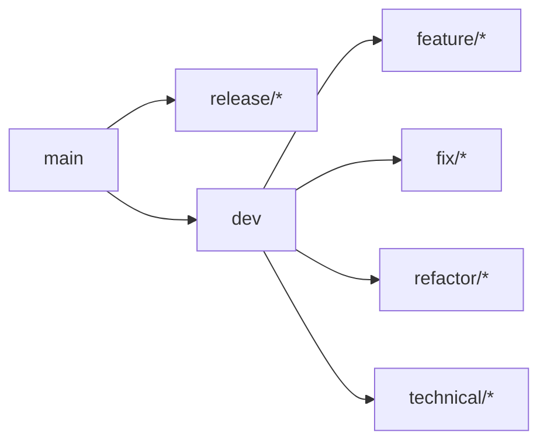

AI-assisted development MUST occur outside protected shared branches.

Examples:

```text
feature/IPV2-123-report-filtering
fix/IPV2-456-invalid-scan-zone
refactor/IPV2-789-notification-handler
```

AI MUST NOT:

```text
push directly to dev
push directly to main
merge into dev
merge into main
approve Pull Requests
bypass branch protection
disable mandatory quality gates
```

Controls MUST be technically enforced through branch protection rather than relying exclusively on written policy. The required protection settings are defined in the section on automated quality gates.

---

## 63. Recommended AI-Assisted Development Cycle

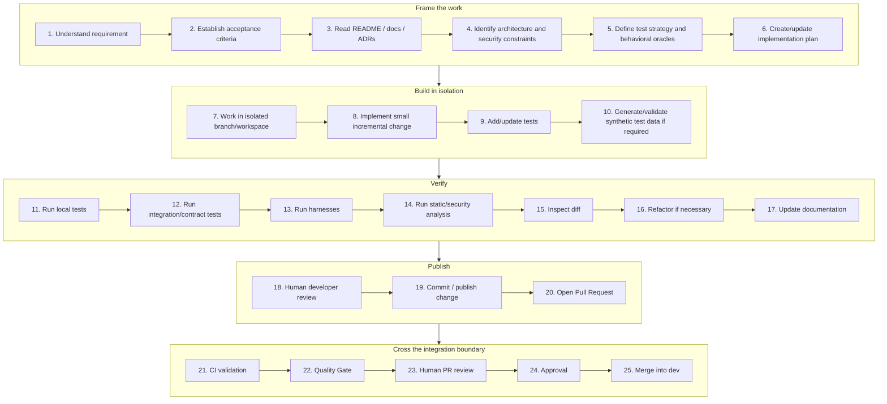

AI can participate extensively in engineering steps.

It cannot independently cross the integration boundary.

---

## 64. CI Quality Pipeline

A mature pipeline SHOULD progressively implement:

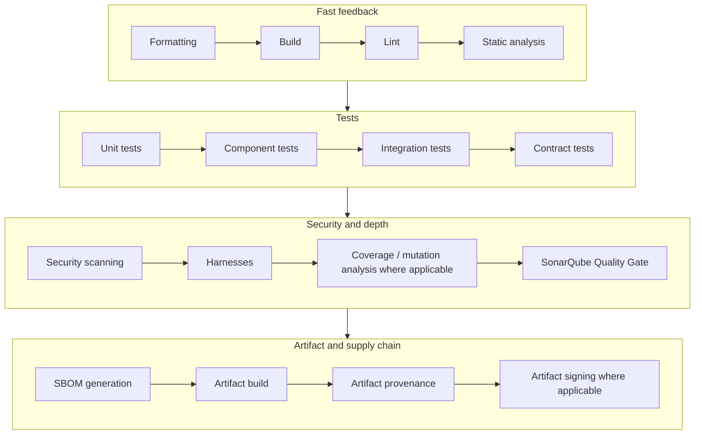

Mandatory failed checks MUST prevent merge.

---

## 65. Definition of Done

Code generation is not completion.

A task is complete when all applicable deliverables are complete:

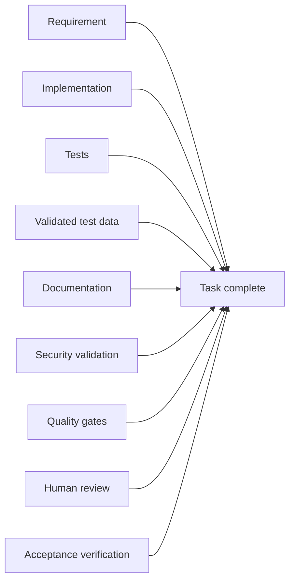

Therefore:

> **Code alone is never the deliverable. Verified behavior is the deliverable.**

---

## 66. Metrics

Teams SHOULD avoid misleading AI productivity metrics such as:

* Lines of AI-generated code.
* Number of prompts.
* Number of AI commits.
* Number of generated tests.

Useful engineering metrics include:

* Lead time.
* Change failure rate.
* Escaped defects.
* Regression rate.
* Review time.
* Test reliability.
* Security findings.
* Mean time to recovery.
* Documentation consistency.
* Percentage of changes automatically verified.

AI adoption is successful when it improves delivery while preserving or improving these engineering outcomes.

---

## 67. Periodic AI Governance Review

AI development practices change fast enough that a periodic review is worth scheduling deliberately — semi-annually is a reasonable starting cadence, plus whenever tool capabilities, platform versions or risks change materially.

Review SHOULD cover:

* AI providers in use.
* Model/data policies.
* Agent permissions.
* Repository access.
* Security incidents.
* Dependency behavior.
* Tool integrations.
* Generated-code defect trends.
* Test effectiveness.
* Engineering productivity.
* Current industry standards.

---

## 68. Proposed Compliance and Enforcement Model

If the team decides to adopt this, it needs a model for what happens when something does not comply. This section proposes one; the level of strictness is itself a decision, and a staged approach — visibility first, blocking checks later — is a reasonable alternative to everything at once.

> **Discussion point.** Strong preventive enforcement gives consistency but can block delivery in edge cases; a lighter model relies on discipline. Where to start, and how quickly to tighten, is an open question.

### Enforcement

* **Preventive rather than punitive.** The controls would live in branch protection, required status checks and quality gates. A Pull Request that fails a required check is corrected rather than waived — the control does the work, so that no individual has to police it.
* **Administrative bypass is an audited event.** Where an emergency merge is performed by bypassing protections, the event MUST be recorded with its justification and the accountable owner, and a remediation change MUST follow within the agreed window. Repeated bypasses are escalated to engineering management.
* **Reversion.** A change merged in breach of what the team agrees, or a change identified after merge as containing an unreviewed or unverified AI-generated defect, is reverted or remediated on a defined timeline according to its risk. Reversion is an engineering decision executed by an authorized human, never an automated action taken by an AI tool.
* **Repository onboarding.** A repository would be considered ready when branch protection, the agreed workflows and the Quality Gate are active. Configuring new repositories before AI-assisted work starts is cheaper than retrofitting.

### Exceptions

Any deviation from an agreed requirement would carry:

1. A documented justification.
2. Explicit approval by the accountable engineering owner.
3. A recorded expiry date or remediation plan.
4. An ADR where the deviation is architecturally significant.

Exceptions are time-bounded by design. An exception that never expires is a requirement nobody believed in, and the honest response is to change the requirement rather than to keep granting the exception.

### Audit trail

The organization SHOULD be able to reconstruct, for any change:

* Who owned it and who approved it.
* Which automated checks ran and what they reported.
* Whether AI assistance was used and in what scope.
* Which requirement or ticket it satisfies.
* Which artifact it produced and where that artifact was deployed.

This information comes from the Pull Request, the CI records and the artifact provenance, not from AI conversation logs. Prompts and AI conversations MUST NOT be archived where they would retain confidential content unnecessarily.

### Keeping the document alive

Part I is expected to be stable; Part II will drift with tooling. A proposed rhythm: review at least semi-annually, and additionally whenever AI tooling capability, framework versions, security standards or organizational risk change materially. Each review would look at, at minimum:

* Supported framework, SDK and runtime versions referenced in the harness templates.
* Linter, analyzer and Quality Gate rule sets, including new AI-specific failure modes observed in production.
* Approved AI tools, providers and data-handling terms.
* Autonomy levels permitted per repository class.

---

## 69. Engineering Governance Model

The final control flow is:

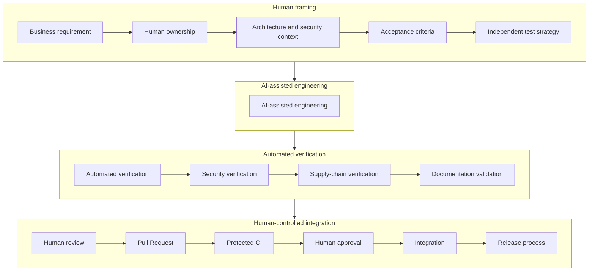

At no point does AI independently cross a software governance boundary.

---

## 70. Final Principles

If the detail of Part I were reduced to what actually matters, it would be these seven ideas. They are the part worth agreeing on first; most of the rest is implementation of them.

### 1. AI accelerates implementation; humans retain accountability.

### 2. Repository documentation and ADRs define authoritative engineering context.

### 3. AI receives minimum necessary context and minimum necessary permissions.

### 4. Generated implementation must be independently verifiable.

### 5. Tests, synthetic data and harnesses are engineering assets, not disposable generated output.

### 6. Automated quality and security controls protect the integration boundary.

### 7. Only humans decide when software is ready to cross that boundary.

The resulting development model is:

> **Human-owned engineering, AI-assisted implementation, independent automated verification, traceable software supply chain, living documentation and human-controlled integration.**

## 71. Open Questions and Decisions Required

This section collects the points that this draft deliberately leaves open. They are the agenda for engineering review rather than positions already taken. Each one is written as a question, with the options currently visible and the provisional position taken in the text so that the draft remains readable.

### Q1 — Status and adoption scope

*Which repositories would this apply to, and from when?*

Options range from applying it to new repositories only, through applying it to repositories that already use AI assistance, to organization-wide adoption with a transition period. A phased approach — principles first, automated enforcement later — is probably easier to sustain than a single cut-over.

*Provisional position in this draft:* nothing is enforced until agreed; Part I is proposed first, Part II follows per stack.

### Q2 — Where the boundary of architectural authority sits

*What exactly is reserved to human decision?*

The draft proposes that AI may analyse, propose alternatives, challenge a decision, surface conflicts with existing ADRs and draft ADR candidates, but does not hold decision authority. The open part is the operational one: which categories of change require an ADR before implementation begins, and who accepts an ADR in each team.

### Q3 — How far an agent may work on a complete feature

*Is feature-scale agent work acceptable when it is planned and checkpointed?*

The draft says yes, provided the work is decomposed, a plan exists, checkpoints are verified and the human controls the result; what it rules out is a single unconstrained generation step accepted wholesale. The question for review is what a "checkpoint" needs to be in practice, and whether the autonomy levels in this document map cleanly onto the agent tooling the teams actually use.

### Q4 — Review depth and generated artifacts

*What must be read line by line, and what is validated differently?*

The draft distinguishes material authored changes, which are reviewed and must be explainable, from generated artifacts — scaffolding, lockfiles, generated clients, schemas, snapshots, bulk fixtures — which are validated through their generator, their input contract and their tests. The open question is where the line falls for each stack, and how the review checklist should express it without becoming a formality.

### Q5 — Granularity of AI traceability

*Is a yes/no declaration still meaningful?*

If most development carries some degree of assistance within a couple of years, a boolean loses its information value. The alternative in the draft is to record the kind of intervention that actually matters for risk — substantial agent-generated change, generated tests, generated synthetic data, assisted migration, assisted security-sensitive code — rather than assistance in general. This needs agreement on the categories before it is put into a Pull Request template, otherwise it becomes noise that everybody ticks.

### Q6 — Quality thresholds

*Which numbers, and who owns them?*

Coverage percentages, duplication limits and rating requirements are in Annex B precisely so that they can be discussed and changed without reopening the standard. The questions are the values themselves, whether they differ per stack or per repository class, whether they apply to new code only, and how existing repositories converge without blocking delivery.

### Q7 — Enforcement and exceptions

*How strict should the integration boundary be at the start?*

The draft proposes preventive controls, audited administrative bypass and time-bounded exceptions. There is a real trade-off: strong preventive enforcement gives consistency but can block delivery in edge cases, while a lighter model depends on discipline. A staged tightening, starting with visibility and moving to blocking checks, is one option.

### Q8 — Approved tooling and data handling

*Which assistants, models and providers are approved, under what data terms?*

This draft states the requirement but not the list, because the list is an organizational decision with contractual implications. It also affects what "minimum necessary context" means in practice for each tool.

### Q9 — Ownership and maintenance of the document

*Who maintains Part I and Part II, and at what cadence?*

Part I is expected to be stable for years; Part II tracks framework, SDK and tooling versions and will drift faster. A named owner and a review rhythm for each are needed for the document to stay credible.

### Q10 — Context tooling and cross-model practice

*What do we invest in, and what stays discretionary?*

Two items from the context-economy section need a decision rather than a recommendation: whether we build or adopt a structural index — a symbol and call graph, or a ranked repository map — for the main codebases, and whether confronting output across different models becomes an expected step for architectural and security-relevant work or is left to each engineer. The first has a cost and an owner; the second has a token cost and only pays off where the decision matters.

### Q11 — Addressable documentation

*Is it worth giving every documentation piece a stable identifier?*

The conceptual-architecture section sketches identifiers such as `ADR-0042` or `SEC-0017`, with relations like `supersedes` and `applies-to`, turning the documentation set into a versioned knowledge graph that both agents and Pull Requests can cite precisely. The open part is whether the discipline is worth its cost: an identifier scheme is cheap to start, useful only if maintained, and awkward to abandon once things reference each other. It also needs an owner, a numbering convention and a decision about what to do with the documents that already exist.

### Q12 — Metrics and evidence of value

*How do we know whether this is helping?*

The draft proposes delivery and quality metrics rather than AI-activity counters. Before adoption it is worth agreeing on a small baseline set that can actually be measured with current tooling, so that the effect of the standard is observable rather than assumed.

---

# Part II — Implementation Profile

*Non-normative annexes. Expected to change with tooling; versioned separately from Part I.*

---

## Annex A — Reference CI Harness Configurations

Non-normative. The workflows below are worked examples of what the quality gate could look like for each stack, offered so that the discussion in Part I has something concrete attached to it. They are starting points to adapt, not configurations to copy unchanged, and they are expected to age faster than anything in Part I.

Where a repository drops one of these steps, the useful discipline is to note why — that note is more valuable than the step itself.

> **Version pinning.** Runtime, SDK and action versions shown here are illustrative and need aligning with what each repository actually targets and with the organization's supported release train. Keeping them current is part of maintaining this annex.

> **SonarQube project configuration.** Each repository would need a `sonar-project.properties` file (or the equivalent scanner parameters) declaring the project key, sources, tests, exclusions and coverage report paths. Excluding generated code, vendored code and build output matters more than it sounds: without it the metrics describe machinery rather than authored work.

### A. Frontend: Angular

AI assistants frequently regress to superseded frontend patterns: direct DOM manipulation instead of the framework's reactivity model, subscriptions that are never released, change-detection misuse, and unnecessary or unverified NPM dependencies.

**Harness objective:** enforce framework-idiomatic reactivity, catch asynchronous and subscription leaks, verify the production AOT build, and prevent unvetted dependencies from entering the tree.

`.github/workflows/angular-harness.yml`

```yaml
name: Angular Quality Harness

on:
  pull_request:
    branches: [ main, develop ]

permissions:
  contents: read

concurrency:
  group: angular-${{ github.ref }}
  cancel-in-progress: true

jobs:
  validate-frontend:
    runs-on: ubuntu-latest
    steps:
      - name: Checkout source code
        uses: actions/checkout@v4
        with:
          fetch-depth: 0   # full history is required for Sonar new-code detection

      - name: Setup Node.js runtime
        uses: actions/setup-node@v4
        with:
          node-version: '22'
          cache: 'npm'

      - name: Install dependencies from lockfile
        run: npm ci

      - name: Audit dependencies
        run: npm audit --audit-level=high

      - name: Verify formatting
        run: npm run format:check

      - name: Lint
        run: npm run lint

      - name: Validate production AOT build
        run: npm run build -- --configuration=production

      - name: Unit and regression tests with coverage
        run: npm run test -- --watch=false --browsers=ChromeHeadless --code-coverage

      - name: SonarQube analysis
        uses: SonarSource/sonarqube-scan-action@v5
        env:
          SONAR_TOKEN: ${{ secrets.SONAR_TOKEN }}
          SONAR_HOST_URL: ${{ secrets.SONAR_HOST_URL }}

      - name: SonarQube Quality Gate
        uses: SonarSource/sonarqube-quality-gate-action@v1
        timeout-minutes: 10
        env:
          SONAR_TOKEN: ${{ secrets.SONAR_TOKEN }}
          SONAR_HOST_URL: ${{ secrets.SONAR_HOST_URL }}
```

Coverage reaches SonarQube through `sonar.javascript.lcov.reportPaths` in `sonar-project.properties`. The test command MUST match the test runner actually configured in the project.

### B. Backend: .NET

AI-generated C# commonly introduces subtle erosion rather than obvious breakage: incorrect `async`/`await` usage, blocking calls on asynchronous paths, incorrect dependency-injection lifetimes, unsafe shared state, and Entity Framework queries that behave acceptably on developer data and degrade badly under production volume.

**Harness objective:** compile with analyzers enforced and warnings treated as errors, verify the data-access layer, and route Roslyn findings into SonarQube.

`.github/workflows/dotnet-harness.yml`

```yaml
name: .NET Quality Harness

on:
  pull_request:
    branches: [ main, develop ]

permissions:
  contents: read

concurrency:
  group: dotnet-${{ github.ref }}
  cancel-in-progress: true

jobs:
  validate-backend:
    runs-on: ubuntu-latest
    steps:
      - name: Checkout source code
        uses: actions/checkout@v4
        with:
          fetch-depth: 0

      - name: Setup .NET SDK
        uses: actions/setup-dotnet@v4
        with:
          dotnet-version: '10.0.x'

      - name: Setup Java runtime required by the Sonar scanner
        uses: actions/setup-java@v4
        with:
          distribution: 'temurin'
          java-version: '17'

      - name: Install SonarScanner for .NET
        run: dotnet tool install --global dotnet-sonarscanner

      - name: Restore NuGet packages
        run: dotnet restore

      - name: Verify formatting
        run: dotnet format --verify-no-changes

      - name: Begin SonarQube analysis
        run: >
          dotnet sonarscanner begin
          /k:"${{ vars.SONAR_PROJECT_KEY }}"
          /d:sonar.host.url="${{ secrets.SONAR_HOST_URL }}"
          /d:sonar.token="${{ secrets.SONAR_TOKEN }}"
          /d:sonar.cs.opencover.reportsPaths="**/coverage.opencover.xml"

      - name: Build with Roslyn analyzers enforced
        run: dotnet build --no-restore --configuration Release /p:TreatWarningsAsErrors=true

      - name: Test with coverage
        run: >
          dotnet test --no-build --configuration Release --verbosity normal
          /p:CollectCoverage=true
          /p:CoverletOutputFormat=opencover

      - name: End SonarQube analysis
        run: dotnet sonarscanner end /d:sonar.token="${{ secrets.SONAR_TOKEN }}"

      - name: SonarQube Quality Gate
        uses: SonarSource/sonarqube-quality-gate-action@v1
        timeout-minutes: 10
        env:
          SONAR_TOKEN: ${{ secrets.SONAR_TOKEN }}
          SONAR_HOST_URL: ${{ secrets.SONAR_HOST_URL }}
```

C# analysis requires the dedicated .NET scanner wrapped around the build; the generic scan action alone does not produce a valid C# analysis. Repositories with a database layer MUST additionally run migration and integration tests against an ephemeral real database, as required by the integration-testing sections of Part I.

### C. Mission-critical: Embedded C / C++

Memory safety is the weakest area of AI-generated native code. Buffer overflows, off-by-one indexing, dangling and uninitialized pointers, unchecked return values, missing `volatile` qualifiers and uninitialized hardware state are all common.

**Harness objective:** enforce deep static application security testing before any firmware artifact can be certified, and treat findings as build failures rather than advisory output.

`.github/workflows/embedded-harness.yml`

```yaml
name: Embedded C/C++ Quality Harness

on:
  pull_request:
    branches: [ main, develop ]

permissions:
  contents: read

concurrency:
  group: embedded-${{ github.ref }}
  cancel-in-progress: true

jobs:
  validate-embedded:
    runs-on: ubuntu-latest
    steps:
      - name: Checkout source code
        uses: actions/checkout@v4
        with:
          fetch-depth: 0

      - name: Install static analysis tooling
        run: |
          sudo apt-get update
          sudo apt-get install -y clang-tidy cppcheck build-essential cmake ninja-build

      - name: Configure build and export the compilation database
        run: cmake -S . -B build -G Ninja -DCMAKE_EXPORT_COMPILE_COMMANDS=ON

      - name: Install the Sonar build wrapper
        uses: SonarSource/sonarqube-scan-action/install-build-wrapper@v5

      - name: Build under the build wrapper
        run: build-wrapper-linux-x86-64 --out-dir bw-output cmake --build build --clean-first

      - name: Cppcheck - memory and vulnerability scan
        run: >
          cppcheck --project=build/compile_commands.json
          --enable=warning,style,performance,portability
          --inline-suppr
          --suppress=missingIncludeSystem
          --error-exitcode=1

      - name: Clang-Tidy - standards and modernization check
        run: run-clang-tidy -p build -quiet -warnings-as-errors=*

      - name: Host-side unit tests
        run: ctest --test-dir build --output-on-failure

      - name: SonarQube native analysis
        uses: SonarSource/sonarqube-scan-action@v5
        with:
          args: --define sonar.cfamily.compile-commands=bw-output/compile_commands.json
        env:
          SONAR_TOKEN: ${{ secrets.SONAR_TOKEN }}
          SONAR_HOST_URL: ${{ secrets.SONAR_HOST_URL }}

      - name: SonarQube Quality Gate
        uses: SonarSource/sonarqube-quality-gate-action@v1
        timeout-minutes: 10
        env:
          SONAR_TOKEN: ${{ secrets.SONAR_TOKEN }}
          SONAR_HOST_URL: ${{ secrets.SONAR_HOST_URL }}
```

C/C++ analysis in SonarQube requires the build wrapper or a compilation database; running the scanner without one yields no meaningful native analysis. Where the project follows a safety coding standard (for example MISRA or AUTOSAR C++), conformance checking MUST be added to this workflow, and hardware-in-the-loop verification MUST occur before release.

### D. Automation and data engineering: Python

Python's dynamism lets incorrect AI output run far before failing: mismatched parameter types, attributes that do not exist, silently swallowed exceptions, unsafe deserialization, shell and SQL injection through string construction, and obsolete or unmaintained libraries.

**Harness objective:** enforce type consistency, formatting standardization and explicit security scanning of common injection vectors.

`.github/workflows/python-harness.yml`

```yaml
name: Python Quality Harness

on:
  pull_request:
    branches: [ main, develop ]

permissions:
  contents: read

concurrency:
  group: python-${{ github.ref }}
  cancel-in-progress: true

jobs:
  validate-python:
    runs-on: ubuntu-latest
    steps:
      - name: Checkout source code
        uses: actions/checkout@v4
        with:
          fetch-depth: 0

      - name: Setup Python
        uses: actions/setup-python@v5
        with:
          python-version: '3.12'
          cache: 'pip'

      - name: Install project and verification tooling
        run: |
          pip install -r requirements.txt
          pip install ruff mypy bandit pip-audit pytest pytest-cov

      - name: Lint (Ruff)
        run: ruff check .

      - name: Verify formatting (Ruff)
        run: ruff format --check .

      - name: Strict static typing (Mypy)
        run: mypy --strict src

      - name: Security audit of source (Bandit)
        run: bandit -r src -ll

      - name: Dependency vulnerability audit
        run: pip-audit -r requirements.txt

      - name: Tests with coverage
        run: pytest --cov=src --cov-report=xml --cov-report=term

      - name: SonarQube analysis
        uses: SonarSource/sonarqube-scan-action@v5
        env:
          SONAR_TOKEN: ${{ secrets.SONAR_TOKEN }}
          SONAR_HOST_URL: ${{ secrets.SONAR_HOST_URL }}

      - name: SonarQube Quality Gate
        uses: SonarSource/sonarqube-quality-gate-action@v1
        timeout-minutes: 10
        env:
          SONAR_TOKEN: ${{ secrets.SONAR_TOKEN }}
          SONAR_HOST_URL: ${{ secrets.SONAR_HOST_URL }}
```

Coverage reaches SonarQube through `sonar.python.coverage.reportPaths=coverage.xml` in `sonar-project.properties`.

### Controls common to every stack

Independently of stack, these are worth running at Pull Request time or on a schedule:

* Secret scanning with push protection enabled.
* Dependency vulnerability scanning and licence compliance.
* Software Composition Analysis and SBOM generation where required by the supply-chain sections of Part I.
* Infrastructure-as-Code and container image scanning where applicable.
* The repository's own harnesses as defined in the test-harness sections.

---

## Annex B — Proposed Quality Gate Baselines

Non-normative. These numbers are a **proposed starting baseline**, not a decision. They live here, apart from Part I, precisely so that they can be discussed, adjusted per stack and revised over time without touching the principles.

They would apply to **new code** in the Pull Request, so that existing debt does not block delivery and new debt does not accumulate silently.

| Condition (new code)                | Baseline threshold | Notes |
|-------------------------------------|--------------------|-------|
| New blocker or critical issues      | 0                  | Merge-blocking. |
| New vulnerabilities                 | 0                  | Merge-blocking. |
| Security hotspots reviewed          | 100 %              | Review is a human action. |
| Reliability rating                  | A                  | |
| Security rating                     | A                  | |
| Maintainability rating              | A                  | |
| Duplicated lines                    | ≤ 3 %              | |
| Coverage — .NET, Python             | ≥ 80 %             | Business logic; excludes generated code. |
| Coverage — Angular                  | ≥ 70 %             | Excludes generated and pure-markup files. |
| Coverage — Embedded C/C++           | ≥ 60 %             | Host-testable logic; hardware-coupled code covered by harnesses. |

Coverage appears as a floor rather than a goal: it measures execution, not verification. The mutation-testing and harness sections of Part I are what actually speak to assertion strength.

### What is open here

* Whether the values are right, and whether they should differ per stack or per repository class.
* Whether coverage floors help at all, or whether they mostly produce tests written to satisfy a percentage.
* How existing repositories converge on them without a period of blocked delivery.
* Who owns these numbers and revises them, and how often.

> **Discussion point.** Coverage is the number most likely to be argued about, and rightly so. If the team prefers no numeric floor at the start — measuring and publishing coverage without blocking on it — that is a reasonable position and easy to tighten later.

---

## Annex C — Draft Pull Request Declaration

Non-normative. This annex sketches how the traceability discussed in Part I could look in practice, so that the discussion has something concrete to react to. The categories below are a starting point for the conversation described in the open questions, not an agreed list.

### Design intent

The declaration tries to capture the *kind and degree* of AI intervention that changes how a reviewer should read the change, rather than whether an assistant was involved at all. A field that everyone always ticks the same way carries no information and costs attention.

Two ideas are worth testing during review:

* Only categories that change reviewer behaviour are worth declaring.
* Where the information can be derived automatically — for example from commit trailers, agent tooling or branch metadata — it should be, rather than asked of the author again.

### Sketch: `.github/pull_request_template.md`

```markdown
## Summary

<what changes and why; link the ticket>

## AI involvement

Tick anything that applies. Leave everything unticked if assistance was
limited to routine completion or explanation.

- [ ] Substantial agent-generated change (an agent produced a significant
      part of the diff rather than isolated fragments)
- [ ] AI-generated tests
- [ ] AI-generated synthetic or fixture data
- [ ] AI-assisted data or schema migration
- [ ] AI-assisted change to security-sensitive code
      (authentication, authorization, cryptography, tenant isolation,
      secrets handling, input validation at a trust boundary)
- [ ] AI-assisted change to CI, infrastructure or deployment configuration

Human owner: <name>

## Verification

- [ ] Material authored changes reviewed and explainable by the author
- [ ] Generated artifacts identified, and validated through their generator,
      contract or tests rather than line by line
- [ ] Tests added or updated; suite passes locally
- [ ] Static analysis and quality gate pass
- [ ] Documentation and ADRs updated where behaviour or architecture changed
- [ ] New dependencies reviewed (existence, identity, licence, advisories)
- [ ] No credentials, secrets or real personal data introduced

Independent evidence relied on: <acceptance criteria, contract, schema,
golden dataset, existing specification, ...>

## Risk notes for the reviewer

<anything the reviewer should look at first: assumptions made, areas the
author is least sure about, behaviour intentionally changed>
```

### Points to settle before this is adopted

* Whether the categories above are the right ones, and whether any of them can be derived automatically instead of declared.
* Whether the security-sensitive category should route the Pull Request to a specific reviewer group.
* Whether the "risk notes" field is genuinely useful or will decay into boilerplate.
* How this interacts with existing templates and with the checklist in Part I, so that the same thing is not asked twice.

---
