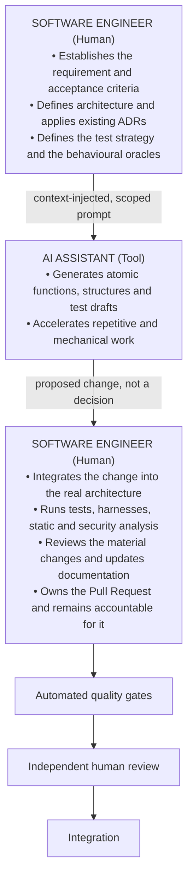

# Human-in-the-Loop: The Engineer's Role

Where engineering attention moves when implementation gets cheaper. The role expands rather than shrinks: design and definition before, integration and validation after.

---

In an AI-assisted environment the engineer's centre of gravity moves from producing lines of code to **designing, integrating and validating** them. The role expands; it does not shrink.

### Design and define

The engineer analyses the business objective, defines acceptance criteria, identifies affected components and security impact, and records architecturally significant decisions as ADRs. Prompts are derived from this work; they do not replace it.

### Integrate

Whether AI output arrives as isolated fragments or as a larger proposed change set, the engineer is responsible for how it lands in the platform: global error handling, centralized logging and telemetry conventions, dependency-injection lifetimes, transaction and concurrency semantics, configuration, resource limits and performance budgets.

### Validate

The engineer is the final authority on whether the change is correct. Validation includes interpreting automated results rather than merely observing that they are green, reviewing the material authored changes, and confirming that the change satisfies the acceptance criteria of the originating requirement.

Generated artifacts — scaffolding, lockfiles, generated clients, schemas, snapshots, bulk fixtures — are validated differently: through the generator and its inputs, the contract they implement and the tests that exercise them, rather than by reading every line. What matters is that somebody decided the generator, the inputs and the expected result, and can say why.

> **The engineer who submits the change is the engineer who answers for it.**

> **Discussion point.** The role description above is a proposal about where engineering attention should move, not a redefinition of anyone's job. It is worth checking against how the teams actually work today.
