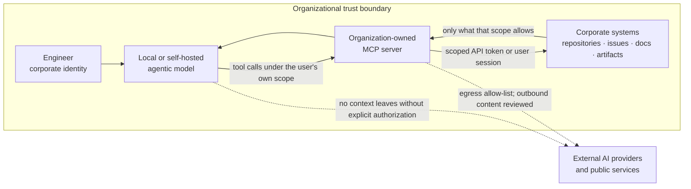

# Local Models and Organization-Owned Agentic Tooling

The deployment where the whole conceptual chain can be enforced at once: an ordinary model authorized to query a well-structured corpus under the identity and permissions of the person asking. A corporate agent implements this framework; it does not define it.

<!-- nav:start -->
`AI-AGT-003` &middot; status **proposed** &middot; domain [`agentic-engineering/`](./)

**Related** &mdash; [AI Autonomy Levels `AI-FND-004`](../ai-foundations/autonomy-levels.md) &middot; [Versioned AI Engineering Instructions `AI-KNOW-004`](../knowledge/ai-engineering-instructions.md) &middot; [Evidence and Verification `AI-PRIN-003`](../principles/evidence-and-verification.md) &middot; [AI Context Boundary `AI-SEC-001`](../security/ai-context-boundary.md) &middot; [Agentic Security Boundary `AI-SEC-002`](../security/agentic-security-boundary.md) &middot; [Shell and Tool Execution `AI-SEC-003`](../security/tool-execution.md) &middot; [Dependency Governance `AI-SEC-005`](../security/dependency-governance.md)

**Derived from** &mdash; [section 23. Local Models and Organization-Owned Agentic Tooling](../compiled/AI-Assisted%20Software%20Engineering%20Framework%20-%20draft%20EN202608161000.md#23-local-models-and-organization-owned-agentic-tooling)
<!-- nav:end -->

---

The controls in the preceding sections constrain what may be placed in an AI context, largely because that context usually leaves the organization. When inference and tool access stay inside the organizational boundary, the underlying risk changes shape: the question stops being *what did we disclose to a third party* and becomes *what did we allow an automated actor to reach and to do*.

This section takes a deliberately positive position. **Building an internal ecosystem of local models and organization-owned tool integrations is permitted and actively advisable**, and is the preferred deployment for engineering work that touches proprietary context. It is the most effective structural answer to the context aggregation risk described in [Agentic Security Boundary](../security/agentic-security-boundary.md): context that never crosses the boundary cannot be accumulated on the other side of it.

Being inside the boundary is not, however, a general exemption. A local agent with broad credentials is a different risk, not a smaller one.

### The pattern this section describes

A corporate identity, a scoped credential, an organization-owned integration layer — Model Context Protocol (MCP) servers or an equivalent tool interface — and a model whose inference runs on organization-controlled infrastructure.

A concrete and useful example: an internal MCP server that connects a local agentic model to the organization's GitHub through an API token, giving it read access to designated repositories and branches so that it can answer questions, analyse code, prepare changes and draft documentation — while destructive and overwriting operations remain outside the tool surface, and the harnesses prevent anything sensitive from being published outward without permission.

Such an ecosystem SHOULD be treated as engineering infrastructure: designed, reviewed, versioned and operated, not assembled ad hoc on individual workstations.

### Identity and authorization

* An agent MUST act under an identifiable corporate identity — the human user's, or a dedicated service identity whose scope is equal to or narrower than that of the human owner.
* An agent MUST NOT exceed the access level that the corresponding corporate account already has. The integration is a convenience layer over existing authorization, never a way around it.
* Shared, long-lived or organization-wide tokens MUST NOT be used to back agent tooling. Credentials SHOULD be scoped to the smallest useful set of repositories, projects and operations, SHOULD be short-lived, and MUST be revocable.
* Credentials MUST NOT be placed in prompts, context files, repository content or agent configuration committed to version control. This is the same separation required in [Versioned AI Engineering Instructions](../knowledge/ai-engineering-instructions.md).
* Where the tooling supports it, access SHOULD be scoped per task rather than granted permanently, so that the credential reflects the work actually being done.

### Read, write and destructive operations

The asymmetry between reading and changing is the most important design decision in an internal agent ecosystem.

* Tool surfaces SHOULD be **read-only by default**. Write capability is added deliberately, per repository and per operation.
* Destructive and overwriting operations MUST be excluded from the agent's tool surface, or gated behind an explicit human confirmation for each invocation. These include, at minimum: force push, history rewrite, branch or tag deletion, protected-branch modification, repository or project settings changes, workflow and CI configuration changes, secret creation or rotation, release publication, package or image publication, issue and Pull Request deletion, and any mutation of production data.
* Write access MUST NOT extend to protected branches. The integration boundary defined in [Evidence and Verification](../principles/evidence-and-verification.md).2 is unchanged by the fact that the model runs locally: an internal agent may prepare a change and open a Pull Request, and MUST NOT approve, merge or release it.
* Access SHOULD be scoped to specific repositories and branch patterns rather than to an organization as a whole. Cross-repository reach remains a privileged operation, for the reasons given in [Agentic Security Boundary](../security/agentic-security-boundary.md).
* Bulk read operations — cloning entire organizations, enumerating all repositories, exporting complete issue histories — SHOULD be treated as privileged even when read-only, because their value to an attacker and their aggregation effect are both high.

### Automatic approval modes

Most agentic tools offer a mode that stops asking: auto-approve, auto-accept, "always allow", unattended or "auto" mode. It is the single setting that most changes the risk profile of an agent, because it converts a misreading, a hallucinated command or an injected instruction into an executed action chain with nobody in the path.

* Blanket automatic approval MUST NOT be enabled when an agent operates on organizational repositories, systems or data. Tool invocations that execute commands, modify files outside a scratch area, or change remote state require a human decision.
* This applies with particular force to shell execution. Long, chained or generated-on-the-fly command lines are exactly the case where a human check is cheapest and its absence is most expensive — a single command can delete work, rewrite history, or reach the network.
* A **curated allow-list is not auto mode**, and is the acceptable middle ground: specific, non-destructive, well-understood operations approved in advance — reading files, `git status` and `git diff`, running the project's tests or build inside the workspace — so that confirmation fatigue does not push engineers into switching approvals off entirely. The allow-list is explicit, reviewed, revocable and narrow; anything outside it prompts.
* Confirmation MUST NOT be reduced to a reflex. A prompt that is always accepted without reading provides no control, which is why the allow-list above exists: to make the prompts that do appear worth reading.
* Genuinely unattended operation — a scheduled agent, a CI-triggered agent — MAY be justified, but is an exception rather than a default. Where it is used it SHOULD run under a dedicated identity with read-only or narrowly scoped write access, inside the constrained environment of [Shell and Tool Execution](../security/tool-execution.md), never against protected branches, with its actions logged and its output entering through a Pull Request like any other change.

This is the same reasoning as the excessive-agency concern in [Agentic Security Boundary](../security/agentic-security-boundary.md), applied to a configuration switch rather than to a design decision.

### Egress and exfiltration control

A component that can both read internal data and reach external endpoints is an exfiltration path, whether or not anyone intended it to be one.

* Read access to internal systems and the ability to reach external endpoints SHOULD be separated across different tools, credentials or servers, so that no single tool holds both halves of that path.
* Outbound network access from agent tooling SHOULD be allow-listed. Arbitrary outbound HTTP from an MCP server is not an acceptable default.
* Any operation that would publish content outside the organization — external issues, public repositories, gists, package registries, third-party services, external documentation — MUST require explicit human authorization for that specific publication, and SHOULD pass secret scanning and sensitive-content checks before it leaves.
* Harnesses and pipeline controls MUST be positioned so that they can block outward publication of sensitive information, not merely record it after the fact.
* Where an agent can post to systems that other people or agents read — issue comments, wiki pages, generated documentation — that output SHOULD be treated as a potential injection channel as well as a potential leak, consistent with [Agentic Security Boundary](../security/agentic-security-boundary.md).

### Inference locality

* Inference on proprietary engineering context SHOULD run on organization-controlled infrastructure: on the engineer's machine, on organization-operated servers, or in a dedicated isolated environment under organizational control.
* Silent fallback to an external provider MUST NOT occur. Where a deployment can route to an external model, that routing MUST be explicit, visible to the engineer at the time, and subject to the same context rules as any other external assistant.
* Prompt logs, tool-call traces and conversation history accumulated by internal tooling MUST be treated as organizational data: retained deliberately, access-controlled, and covered by a retention policy. These stores are themselves an accumulation of context in the sense of [Agentic Security Boundary](../security/agentic-security-boundary.md).
* Model weights, adapters and fine-tuning datasets derived from proprietary material MUST be handled as proprietary assets, including for storage location, access control and disposal.

### The tooling is itself a dependency

MCP servers, agent frameworks, plugins and model artifacts enter the engineering environment with unusually high privilege. They are subject to the dependency governance requirements of [Dependency Governance](../security/dependency-governance.md), and additionally:

* Third-party MCP servers and agent plugins SHOULD be reviewed before installation, pinned to specific versions, and obtained from verified sources.
* Tool definitions, tool descriptions and tool output MUST be treated as untrusted input. A tool description is text that reaches the model, and is therefore an injection surface as described in [Agentic Security Boundary](../security/agentic-security-boundary.md).
* Agent tooling SHOULD run in the constrained execution environment described in [Shell and Tool Execution](../security/tool-execution.md).
* An internally built MCP server is a production service in security terms, and SHOULD receive design review, code review, authentication, authorization, logging and dependency maintenance accordingly.

### Auditability

* Tool invocations SHOULD be logged with the acting identity, the tool, the target, the parameters (with sensitive values redacted) and the outcome.
* Logs SHOULD be retained for a defined period and be reviewable during incident investigation, consistent with the audit trail described in the compliance section.
* Destructive operations that were permitted by exception SHOULD be individually traceable to the human who authorized them.

### What this does not change

An internal deployment relaxes the constraints on *context*, not the constraints on *integration*. Everything else in Part I continues to apply unchanged: the autonomy levels in [AI Autonomy Levels](../ai-foundations/autonomy-levels.md), the Pull Request boundary, the quality gates, human review, and the rule that only a human decides when software crosses into a shared branch.

It also does not make every task an internal-tooling task. External assistants remain reasonable for work whose context is genuinely non-proprietary — public APIs, generic boilerplate, general language questions, documentation phrasing — under the context boundary in [AI Context Boundary](../security/ai-context-boundary.md). The distinction worth institutionalizing is:

1. Proprietary context, sensitive know-how, customer-specific solutions, security mechanisms → internal ecosystem, by preference.
2. Non-proprietary context → either, under the ordinary context rules.
3. Any context at all → the integration boundary and the human accountability model are identical in both cases.

> **Discussion point.** Three things need deciding before this becomes real: what "local" means for us in each case (engineer workstation, on-premises server, or an isolated tenant we control), who builds and operates the MCP layer and with what capacity, and which teams and stacks go first. The security position above is the easy part; the operational ownership is what determines whether this exists in practice.
