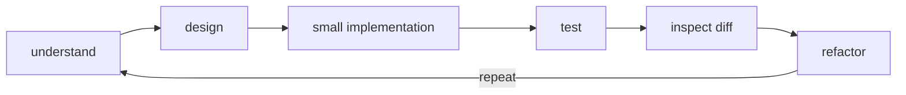
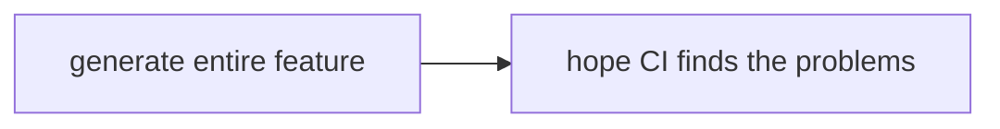

# Small-Batch AI Development

A change is accepted at the speed it can be understood. Reviewability, not model capability, is the constraint that sets batch size.

---

AI-assisted modifications work better small — not because a capable agent cannot handle more, but because a change is accepted at the speed it can be understood.

Large unconstrained generation makes review harder and increases the probability that architectural or behavioral inconsistencies remain unnoticed.

Prefer:

over:

Reviewability is the constraint that matters. Feature-scale work is compatible with it when it is decomposed and checkpointed, as described in [the prompting section](context-informed-prompting.md); what is not compatible with it is a single large generation accepted in one piece.
