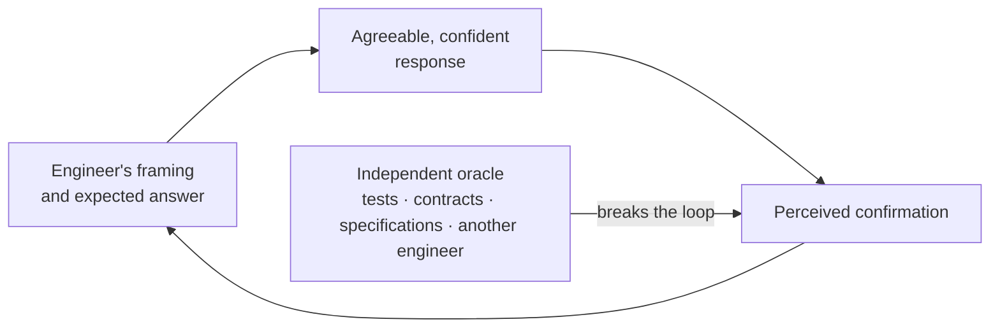

# Agentic Bias

Designed agreeableness and miscalibrated confidence, and why a session tends to confirm its own output. This is the reason verification has to come from outside the conversation that produced the work.

---

The previous section describes what models cannot do. This one describes something subtler and, in day-to-day work, more consequential: the way assistants are built makes it hard for the engineer to notice when they are wrong.

Assistants are optimized to be useful, and perceived usefulness is largely what their training signal rewards. A response that agrees, complies and produces something is rated better by users than one that hesitates, refuses or answers "I do not know" — even when the second is the correct response. Agentic systems inherit that disposition and add action to it.

The result is not dishonesty. It is a systematic tilt toward agreement, completion and confident presentation, which the engineer then reads as competence.

### How it shows up

* **Agreement under pressure.** Challenging a correct answer will often cause it to be revised. If pushing back flips the conclusion, neither version has been demonstrated — the change reflects the pressure, not new evidence.
* **Confidence uncorrelated with accuracy.** Fluency, structure and the absence of hedging are properties of the generation, not signals about its truth. A wrong answer arrives in the same register as a right one.
* **Two-way confirmation.** The engineer's framing shapes the response, and the response then reinforces the framing. What looks like a second opinion is the same reasoning path returned with better prose. This is the mechanism that turns a single assumption into an apparently corroborated one.
* **Agentic amplification.** An agent that acts produces visible progress — files changed, tests added, a green run — and visible progress feels like verification. Completion is not correctness. An agent asked to review its own work will, in the ordinary case, confirm it.
* **Automation bias in review.** A change that arrives complete, consistent and articulate tends to attract less scrutiny than a rougher human-authored change carrying the same risk. Polish is not a quality signal.

### Working practices

Scepticism here is a technique, not an attitude. The practices below are cheap, and they are what keeps the loop above open.

* Engineers SHOULD read what an assistant proposes as a hypothesis to be judged, not as an answer to be integrated. The useful questions are: what would have to be true for this to be wrong, what did it not check, and what does it fail on.
* Engineers SHOULD ask for **concrete, checkable evidence** rather than explanation: the file and line where the behaviour actually lives, the exact API signature, the documentation section, the test that demonstrates the claim, the command output that supports it. An assertion the engineer cannot trace to something verifiable MUST be treated as unverified.
* References, package names, API members and configuration keys produced by an assistant MUST be confirmed to exist before they are relied upon. Plausible-looking citations to things that do not exist are a routine failure mode, not an exceptional one.
* When an agent reports that something worked, the evidence is the command output, the test result or the diff — not the agent's summary of them.
* Prompts SHOULD avoid embedding the expected conclusion. "This is wrong, isn't it?" reliably produces agreement. Ask for an assessment when an assessment is wanted, and state constraints when an implementation is wanted.
* Asking the same session whether its own output is correct produces agreement, not verification. The independent-oracle requirement in the verification-independence section exists precisely for this reason, and the subsection below describes the cheaper habit that does work.
* Disagreement between the engineer and the assistant SHOULD be resolved by evidence rather than by re-prompting until the answer becomes acceptable. Re-prompting to obtain a preferred answer is selection, not analysis.
* Reviewers SHOULD calibrate scrutiny to the risk of the change rather than to how finished it looks, consistent with the AI-specific failure modes listed in the human-review section.

None of this is a new requirement. The governing principles already state that confidence expressed by a model is not evidence of correctness; what this section adds is the reason that is so easy to forget in practice — the tool is agreeable by construction, and agreeableness reads as competence.

### Confronting models against each other

The natural countermeasure to agreeableness is a second opinion. The important detail is where that opinion comes from.

Asking an assistant to review its own output is close to useless for this purpose: without external feedback, models struggle to correct their own reasoning, and accuracy sometimes *drops* after a self-correction pass. Running several instances of the same model does little better — they share training data, priors and failure modes, so they tend to agree for the same reasons, and models used as judges show a measurable preference for outputs resembling their own.

What does work is confronting the output of one model with a **different** model — different vendor, different family, ideally different training lineage — and letting the disagreement surface. The published results on multi-agent debate point the same way: the gains appear when the agents are genuinely diverse, when critiques are grounded in explicit steps and facts rather than opinions, and when the adjudicator rewards verifiable reasoning over confident assertion.

This holds for reasoning models too. Extended reasoning improves the path a model takes; it does not make that path independent of the model's own assumptions. A reasoning model confronted with a competing analysis still produces sharper output than the same model asked to double-check itself.

This is offered as practice rather than as a control, and it is worth its cost only where the decision is.

* For work that carries real consequence — architecture options, security-relevant logic, subtle concurrency or data-integrity questions, a large or unfamiliar diff, an ADR draft — engineers SHOULD consider putting the output in front of a different model and asking it to find what is wrong with it, rather than to improve it. For routine work it is overhead.
* The exercise works better when the second model receives the task, the constraints and the evidence, but not the first model's conclusion presented as the expected answer. What is being tested is whether the conclusion survives an independent attempt, not whether a second model will agree with something it was handed.
* Two or three rounds usually extract most of the value. Beyond that the exchange tends to converge on style rather than substance, and the tokens are better kept for the problem — see [the context-economy section](context-economy.md) that follows.
* Agreement between models is not proof. Their training corpora overlap, so they can be wrong together and sound corroborated doing it. Convergence is a weaker signal than a single passing test, and no quantity of it satisfies the independent-oracle expectation set out in the verification-independence section.

The oracle remains what it was: a test, a contract, a specification, a schema, a golden dataset, an observed behaviour. Cross-model confrontation is a cheap way to find weaknesses earlier and to break the confirmation loop described above — it is not a substitute for external evidence, and nothing here is intended to make it a precondition for merging anything.

### The engineer is inside the loop too

The bias is not only in the tool. Under delivery pressure, an assistant that confirms the approach already chosen is genuinely pleasant to work with, and that is exactly when its agreement is least informative. The reason to name this in an engineering standard is that an unnamed bias is invisible: engineers cannot compensate for a distortion they have not been told to expect.

> **Discussion point.** This section is about habits, and habits are not enforceable by a quality gate. The open question is whether anything here should become a review expectation — for example, that a Pull Request carrying significant AI-generated work names the independent evidence relied upon — or whether it should stay as shared practice, with the risk that it quietly stops happening.
