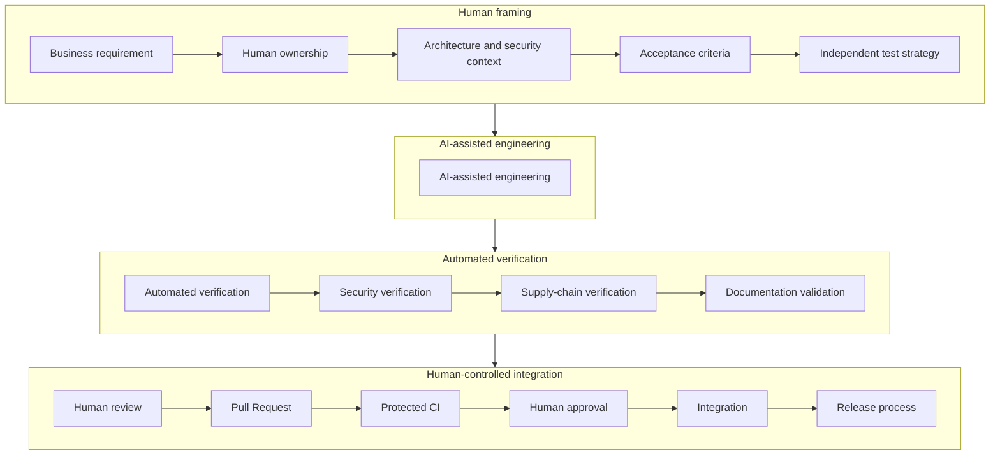

# Engineering Governance Model

Who owns the framework, who may change it, and how authority is distributed.

<!-- nav:start -->
`AI-GOV-001` &middot; status **proposed** &middot; domain [`governance/`](./)

**Derived from** &mdash; [section 69. Engineering Governance Model](../compiled/AI-Assisted%20Software%20Engineering%20Framework%20-%20draft%20EN202608161000.md#69-engineering-governance-model)
<!-- nav:end -->

---

The final control flow is:

At no point does AI independently cross a software governance boundary.
