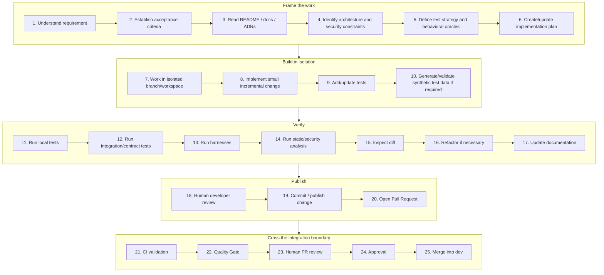

# AI-Assisted Development Cycle

The end-to-end sequence from requirement to merge, showing how far an agent can work and exactly where it stops.

<!-- nav:start -->
`AI-INT-001` &middot; status **accepted** &middot; domain [`integration/`](./)

**Derived from** &mdash; [section 63. Recommended AI-Assisted Development Cycle](../compiled/AI-Assisted%20Software%20Engineering%20Framework%20-%20draft%20EN202608161000.md#63-recommended-ai-assisted-development-cycle)
<!-- nav:end -->

---

AI can participate extensively in engineering steps.

It cannot independently cross the integration boundary.
