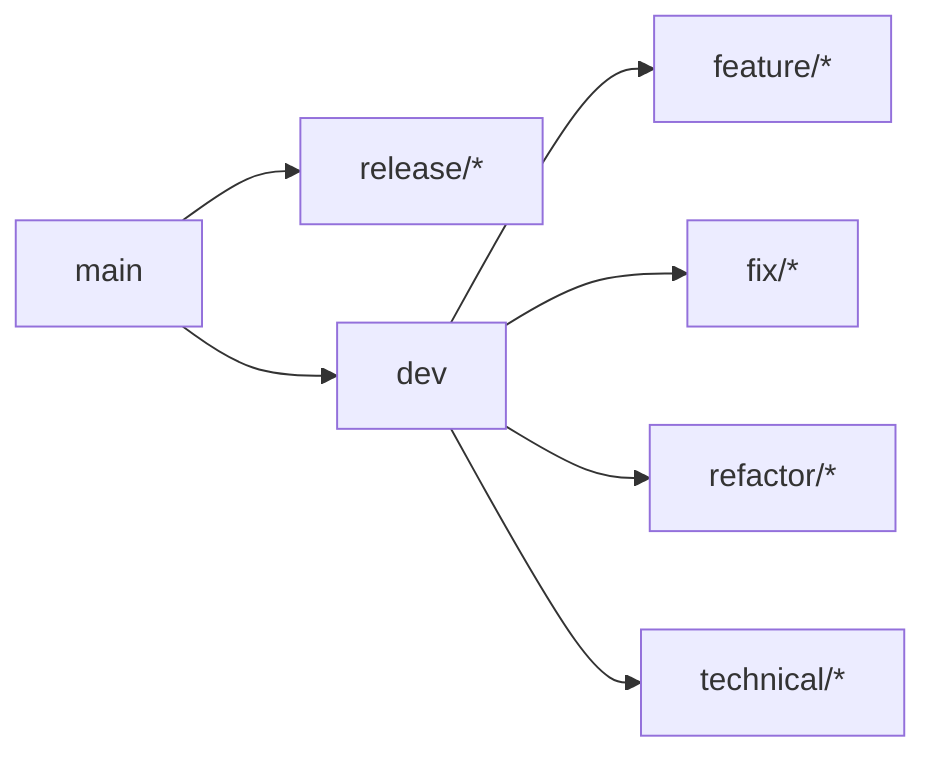

# Branch Management

Assisted work happens outside protected branches, whatever those branches are called. The branching model is a team decision; the boundary is not.

<!-- nav:start -->
`AI-INT-002` &middot; status **proposed** &middot; domain [`integration/`](./)

**Related** &mdash; [Automated Quality Gates and CI Pipeline `AI-INT-005`](quality-gates.md)

**Derived from** &mdash; [section 62. Branch Management](../compiled/AI-Assisted%20Software%20Engineering%20Framework%20-%20draft%20EN202608161000.md#62-branch-management)
<!-- nav:end -->

---

The branching model itself is a team decision, and the one below is simply the model this framework assumes. What the document argues for is narrower: that AI-assisted work happens outside protected branches, whatever those branches are called.

Assumed model:



AI-assisted development MUST occur outside protected shared branches.

Examples:

```text
feature/IPV2-123-report-filtering
fix/IPV2-456-invalid-scan-zone
refactor/IPV2-789-notification-handler
```

AI MUST NOT:

```text
push directly to dev
push directly to main
merge into dev
merge into main
approve Pull Requests
bypass branch protection
disable mandatory quality gates
```

Controls MUST be technically enforced through branch protection rather than relying exclusively on written policy. The required protection settings are defined in [the section on automated quality gates](quality-gates.md).
