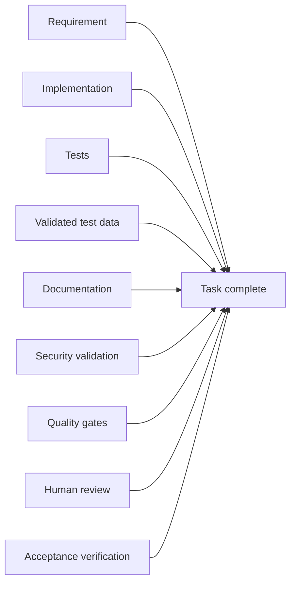

# Definition of Done

Code generation is not completion. Verified behaviour is the deliverable.

---

Code generation is not completion.

A task is complete when all applicable deliverables are complete:

Therefore:

> **Code alone is never the deliverable. Verified behavior is the deliverable.**
