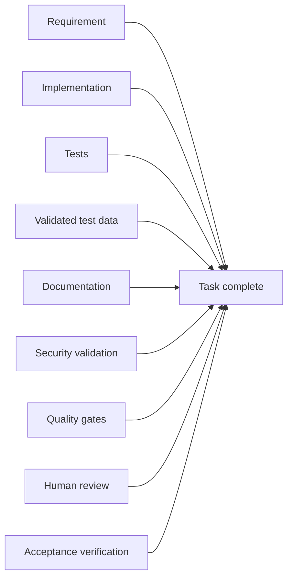

# Definition of Done

Code generation is not completion. Verified behaviour is the deliverable.

<!-- nav:start -->
`AI-INT-006` &middot; status **accepted** &middot; domain [`integration/`](./)

**Derived from** &mdash; [section 65. Definition of Done](../compiled/AI-Assisted%20Software%20Engineering%20Framework%20-%20draft%20EN202608161000.md#65-definition-of-done)
<!-- nav:end -->

---

Code generation is not completion.

A task is complete when all applicable deliverables are complete:

Therefore:

> **Code alone is never the deliverable. Verified behavior is the deliverable.**
