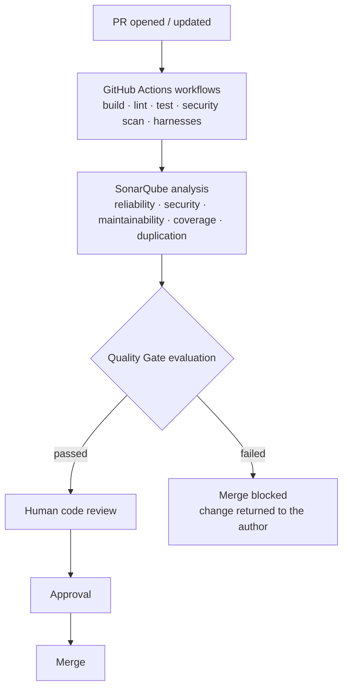
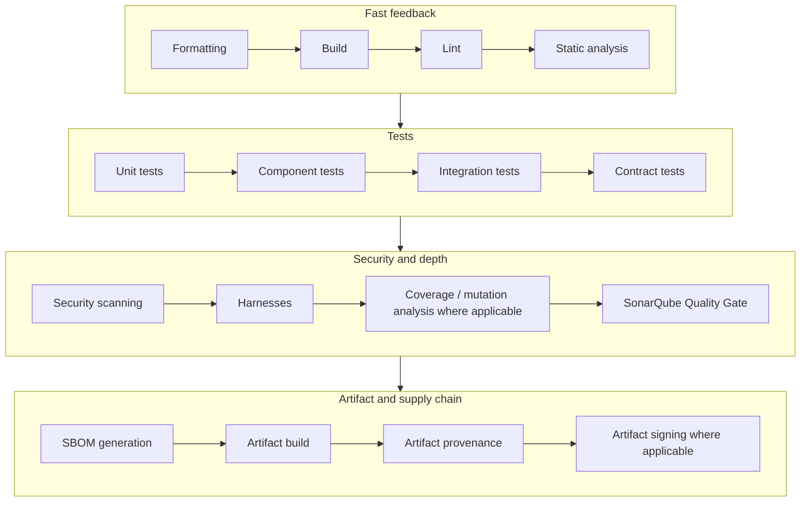

# Automated Quality Gates and CI Pipeline

The checks that run without asking anyone, and the branch protection that makes them a boundary rather than a suggestion. Concrete thresholds live in the implementation profiles so that changing a number does not reopen the framework.

---

## Automated Quality Gates: Proposed Model

The boundaries described in Part I are easier to hold with automation than with intention. The proposal is that each repository using AI-assisted development runs an automated quality gate on Pull Requests, of roughly this shape:

The automated gate is a **necessary** condition for merge. It is never a **sufficient** one: human review remains mandatory in all cases.

### Suggested branch protection

The following seem worth enforcing technically on `main`, `release/*` and the shared development branch, rather than only documenting:

* **No direct pushes.** All changes enter through a Pull Request.
* **Required status checks.** All applicable workflows and the SonarQube Quality Gate MUST report success before a Pull Request becomes mergeable.
* **Required human approval.** At least one approving review from an engineer other than the author. Security-sensitive, architectural or migration changes SHOULD require a second reviewer with the relevant competence.
* **Dismiss stale approvals** when new commits are pushed.
* **Conversation resolution required** before merge.
* **Linear history and up-to-date branches** where the branching model supports it.
* **No force pushes and no branch deletion** on protected branches.
* **Restricted bypass.** Administrative bypass SHOULD be disabled; where it is retained for emergency use it MUST be logged and reviewed as described in the compliance section.

### Workflow security

CI configuration is itself part of the attack surface, and a frequent target of AI-generated shortcuts:

* Workflows analysing untrusted contributions MUST NOT use `pull_request_target` with a checkout of the contributor's code while holding repository secrets.
* Actions SHOULD be pinned to a released major version at minimum, and to a commit SHA for security-critical actions.
* Workflow `permissions` SHOULD be declared explicitly and minimally (`contents: read` by default).
* Secrets MUST be provided through the secret store; they MUST NOT appear in workflow files, logs, cached artifacts or generated code.
* Workflow definitions changed by an AI assistant MUST receive the same review scrutiny as production code.

### Thresholds

Concrete thresholds — coverage, duplication, ratings — are deliberately **not** in Part I. They are proposed in **[Annex B](../profiles/quality-gates/baselines.md)** so that they can be argued about, adjusted per stack and changed over time without reopening the standard.

> **Discussion point.** The right question for Part I is whether a repository should have a gate at all and what it protects; the right question for [Annex B](../profiles/quality-gates/baselines.md) is what the numbers are. Keeping them apart is itself a proposal.

---

## CI Quality Pipeline

A mature pipeline SHOULD progressively implement:

Mandatory failed checks MUST prevent merge.
