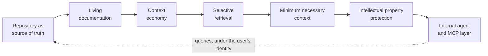

# Engineering Principles

The seven ideas the rest of the corpus implements, and the conceptual chain that connects them. If consensus fails here, nothing further down is worth arguing about yet.

---

## Final Principles

If the detail of Part I were reduced to what actually matters, it would be these seven ideas. They are the part worth agreeing on first; most of the rest is implementation of them.

### 1. AI accelerates implementation; humans retain accountability.

### 2. Repository documentation and ADRs define authoritative engineering context.

### 3. AI receives minimum necessary context and minimum necessary permissions.

### 4. Generated implementation must be independently verifiable.

### 5. Tests, synthetic data and harnesses are engineering assets, not disposable generated output.

### 6. Automated quality and security controls protect the integration boundary.

### 7. Only humans decide when software is ready to cross that boundary.

The resulting development model is:

> **Human-owned engineering, AI-assisted implementation, independent automated verification, traceable software supply chain, living documentation and human-controlled integration.**

---

## Conceptual Architecture: One Chain

A document this long risks reading as a list of unrelated rules, and worse, as the same rule restated from too many angles. It is neither. Most of Part I is one idea followed through its consequences, and the sections that look like repetition are links in a single chain.

Naming the chain here is an attempt to make the rest shorter to read: once the shape is visible, each later section can be read as *the place where one link is developed* rather than as a new demand.

| Link | What it asserts | Developed in |
|---|---|---|
| Repository as source of truth | The authoritative account of the system lives in the repository, not in conversations, tickets or memory. | [Repository as Engineering Source of Truth](../knowledge/repository-source-of-truth.md) |
| Living documentation | That account is only authoritative if it is kept true; documentation that contradicts the implementation is a defect. | [Living Documentation](../knowledge/living-documentation.md) |
| Context economy | Attention is finite and degrades with volume; a large corpus helps only if it can be consumed in small, high-signal pieces. | [Context Economy](../ai-foundations/context-economy.md) |
| Selective retrieval | Which requires the corpus to be navigable — structure, identifiers and indexes that let an agent find rather than be given. | [Context Economy](../ai-foundations/context-economy.md) |
| Minimum necessary context | Which is what makes it possible to supply only what the task needs, rather than everything available. | [AI Context Boundary](../security/ai-context-boundary.md) |
| IP protection | Which is also the main preventive control against progressive disclosure, because what is never supplied cannot be aggregated. | [Agentic Security Boundary](../security/agentic-security-boundary.md) |
| Internal agent and MCP layer | And the deployment where all of the above can be enforced at once, under a corporate identity and its existing permissions. | [Local Models and Organization-Owned Agentic Tooling](../agentic-engineering/local-and-corporate-agents.md) |

### Why the order matters

Each link depends on the one before it, which is why weakening any of them quietly weakens the rest:

* If the repository is not the source of truth, there is nothing authoritative to retrieve, and every agent works from someone's recollection.
* If documentation is not kept alive, retrieval returns confident statements that are no longer true — and the agent cannot date them.
* If the corpus is not navigable, engineers compensate by pasting more, which is precisely what context economy says degrades the result.
* If retrieval cannot be selective, minimum necessary context is unenforceable in practice, whatever the policy says.
* If context is not minimal, intellectual-property protection is left to individual judgement at the moment of greatest delivery pressure.
* And an internal agent without the preceding links is just a local model with broad credentials — which [the tooling section](../agentic-engineering/local-and-corporate-agents.md) is explicit about not being an improvement.

### Read in the other direction

The same chain read backwards describes the useful end state, and it is worth stating because it is not the obvious one.

An effective corporate agent is not a model trained on everything the organization has. It is an ordinary model **authorized to query a well-structured, addressable corpus — documentation and code — under the identity and permissions of the person asking**, retrieving only what the question requires.

That framing changes what the organization has to build. Not a training pipeline, not a proprietary model: a repository worth querying, an index that makes it navigable, identifiers stable enough to cite, and an access layer that respects who is asking. Most of that is engineering hygiene the organization wants anyway; the agent is what makes the investment visible.

---

## Least privilege for AI

AI agents MUST operate according to the same least-privilege principle applied to human users and software services.

An AI agent SHOULD receive only:

1. The context required for the task.
2. The tools required for the task.
3. The permissions required for the task.
4. Access for the time required to perform the task.

Repository visibility does not imply infrastructure visibility.

Code access does not imply deployment access.

Read access does not imply write access.

Write access does not imply merge authority.
