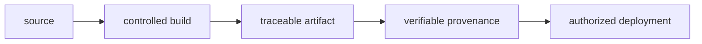

# Artifact Provenance and Signing

Being able to say what an artifact is, where it came from, and which source it was built from.

---

Higher-assurance systems SHOULD generate verifiable build provenance and SHOULD consider signing release artifacts.

The organization SHOULD progressively adopt software-supply-chain controls consistent with frameworks such as SLSA.

Where signing is implemented, artifacts may include:

* Container images.
* Binaries.
* Packages.
* SBOMs.
* Build attestations.

The objective is to establish:

